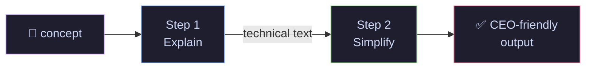

# 01 · LangChain Basics — Prompts, LLMs & Chains

> The three foundational building blocks of every LangChain application.

---

## What You'll Learn

- How LangChain wraps multiple LLM providers behind a **unified interface**
- Building **reusable prompt templates** with variables and few-shot examples
- Connecting components with the **pipe operator** (`|`) into executable chains
- Running **sequential chains**, **batch processing**, and **streaming**

## Quick Start

```bash
pip install langchain langchain-openai langchain-anthropic
```

```bash
export OPENAI_API_KEY="sk-..."
export ANTHROPIC_API_KEY="sk-ant-..."
```

```bash
jupyter notebook langchain_basics.ipynb
```

---

## Core Concepts at a Glance

### 🔌 Unified LLM Interface

LangChain lets you swap providers with zero downstream changes:

```python
from langchain_openai import ChatOpenAI
from langchain_anthropic import ChatAnthropic

# Initialize two different providers — same interface, different models
gpt    = ChatOpenAI(model="gpt-4o-mini", temperature=0)
claude = ChatAnthropic(model="claude-sonnet-4-20250514", temperature=0)

# Both use .invoke() — swap providers without changing downstream code
gpt.invoke("What is LangChain?")
claude.invoke("What is LangChain?")
```

**Why this matters →** Build once, evaluate across models. Switch from GPT to Claude (or Llama, Mistral, Gemini) with one line.

---

### 📝 Prompt Templates

Separate prompt engineering from application code:

```python
from langchain_core.prompts import ChatPromptTemplate

# Define a reusable template with variable placeholders {role} and {question}
prompt = ChatPromptTemplate.from_messages([
    ("system", "You are a {role}. Be concise — 2 sentences max."),
    ("human", "{question}")
])

# Reuse the same template with different inputs — no prompt rewriting needed
prompt.invoke({"role": "ML engineer", "question": "What is RLHF?"})
```

**Few-shot prompting** — steer output format with examples:

```python
from langchain_core.prompts import FewShotChatMessagePromptTemplate

# Provide example input→output pairs so the LLM mimics this exact format
examples = [
    {"input": "What is gradient descent?",
     "output": "CONCEPT: Gradient Descent\nCATEGORY: Optimization\nTLDR: Iteratively adjust params in the direction of steepest loss reduction."},
]

# Wraps examples into a prompt the LLM sees before your actual question
few_shot = FewShotChatMessagePromptTemplate(
    example_prompt=example_prompt, examples=examples
)
```

---

### ⛓️ Chains — The Pipe Operator

The `|` operator is LangChain's core abstraction. Connect `prompt → model → parser`:

```python
from langchain_core.output_parsers import StrOutputParser

# Pipe operator chains components: prompt formats → LLM generates → parser extracts string
chain = prompt | gpt | StrOutputParser()

# .invoke() runs the full pipeline end-to-end with your input dict
result = chain.invoke({
    "role": "data scientist",
    "question": "XGBoost vs neural networks?"
})
```

**How it flows:**


---

### 🔗 Sequential Chains — Multi-Step Pipelines

Chain LLM calls together. Output of step 1 feeds into step 2:

```python
# Step 1: Generate a technical explanation from the concept
step1 = explain_prompt | gpt | StrOutputParser()

# Step 2: Take that technical explanation and simplify it for executives
step2 = simplify_prompt | gpt | StrOutputParser()

# Connect steps: step1's output becomes step2's input via the "technical_explanation" key
full_chain = {"technical_explanation": step1} | step2

# One invoke runs both LLM calls in sequence
result = full_chain.invoke({"concept": "vector embeddings"})
```



---

### ⚡ Batch & Streaming

```python
# Batch — process multiple inputs in parallel (one API call per input, run concurrently)
results = chain.batch([
    {"role": "ML engineer", "question": "What is attention?"},
    {"role": "ML engineer", "question": "What is RLHF?"},
])

# Stream — token-by-token output for real-time UX (chatbot-style)
for chunk in chain.stream({"role": "poet", "question": "Describe transformers"}):
    print(chunk, end="", flush=True)  # prints each token as it arrives
```

---

## Cheat Sheet

<table>
<tr>
<th>Concept</th>
<th>Code</th>
<th>Purpose</th>
</tr>
<tr>
<td><b>LLM Wrapper</b></td>
<td><code>ChatOpenAI()</code> / <code>ChatAnthropic()</code></td>
<td>Unified <code>.invoke()</code> across providers</td>
</tr>
<tr>
<td><b>Prompt Template</b></td>
<td><code>ChatPromptTemplate.from_messages()</code></td>
<td>Reusable prompts with variables</td>
</tr>
<tr>
<td><b>Few-Shot</b></td>
<td><code>FewShotChatMessagePromptTemplate</code></td>
<td>Steer output format via examples</td>
</tr>
<tr>
<td><b>Chain</b></td>
<td><code>prompt | llm | parser</code></td>
<td>Pipe components into a pipeline</td>
</tr>
<tr>
<td><b>Sequential</b></td>
<td><code>{"key": chain1} | chain2</code></td>
<td>Multi-step LLM pipelines</td>
</tr>
<tr>
<td><b>Batch</b></td>
<td><code>chain.batch([...])</code></td>
<td>Parallel processing</td>
</tr>
<tr>
<td><b>Stream</b></td>
<td><code>chain.stream({...})</code></td>
<td>Real-time token output</td>
</tr>
</table>

---

## File Structure

```
01-langchain-basics/
├── README.md                  ← you are here
└── langchain_basics.ipynb     ← runnable notebook
```

## Next Up

➡️ **[02 · LCEL Deep Dive](../02-lcel-deep-dive/)** — RunnableParallel, RunnableLambda, fallbacks, routing

---

<p align="center">
  Part of the <a href="https://github.com/hitpant/langchain-tutorials">LangChain Tutorials</a> series by <a href="https://github.com/hitpant">Hitesh Pant</a>
</p>
