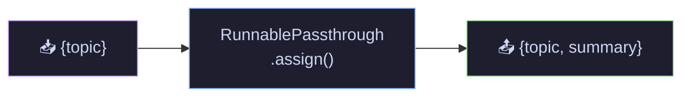
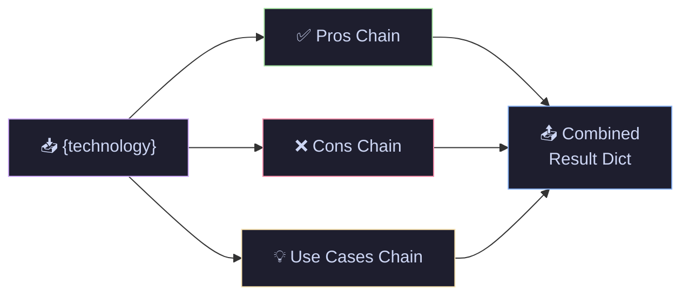
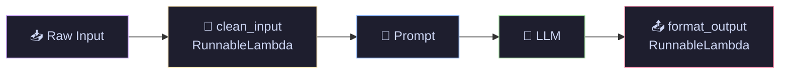
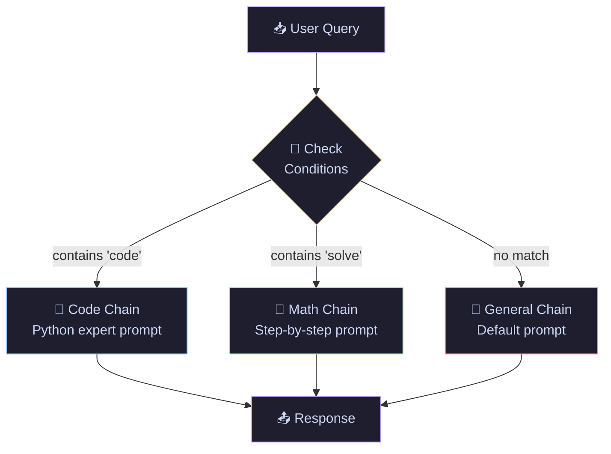
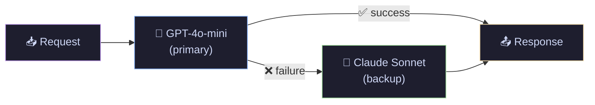

# 02 · LCEL Deep Dive — LangChain Expression Language

> In Tutorial 01, we used the `|` pipe to build simple chains. But real apps need parallel execution, routing, fallbacks, and custom logic. LCEL gives you 5 building blocks to handle all of that.

---

## What You'll Learn

- **RunnablePassthrough** — keep original input while adding computed fields
- **RunnableParallel** — run multiple chains at the same time
- **RunnableLambda** — inject any Python function into a chain
- **RunnableBranch** — route inputs to different chains conditionally
- **Fallbacks** — automatic backup when a model fails

## Quick Start

```bash
pip install langchain langchain-openai langchain-anthropic
```

```bash
jupyter notebook lcel_deep_dive.ipynb
```

---

## Core Concepts

### ➡️ RunnablePassthrough — Keep Original Input While Adding New Data

**The Problem:** You send `{"topic": "RAG"}` into a summarization chain. It returns a summary string — but now you've **lost** the original topic. All you have is the summary.

**The Solution:** `RunnablePassthrough.assign()` keeps your original data intact and **adds** new computed fields alongside it. Think of it like a conveyor belt — your package stays on the belt, and `.assign()` sticks a new label on it as it passes through.

```python
from langchain_core.runnables import RunnablePassthrough

summary_chain = prompt | llm | StrOutputParser()

# Keeps {"topic": "..."} AND adds {"summary": "..."}
chain = RunnablePassthrough.assign(
    summary=summary_chain  # run this chain, store result under "summary" key
)

result = chain.invoke({"topic": "Transformer architecture"})
# result = {"topic": "Transformer architecture", "summary": "Transformers use..."}
#            ↑ preserved from input                ↑ added by .assign()
```



**When to use:** RAG pipelines (need the user's question AND retrieved context), any chain where downstream steps need the original input.

---

### ⚡ RunnableParallel — Run Multiple Chains at the Same Time

**The Problem:** You want to analyze a technology from 3 angles — pros, cons, and use cases. Running them sequentially is slow: each chain waits for the previous one to finish.

**The Solution:** `RunnableParallel` runs all chains **simultaneously** on the same input. It's like having 3 analysts working on the same question at the same time instead of passing it around one by one. If each chain takes 2 seconds: sequential = 6s, parallel ≈ 2s.

```python
from langchain_core.runnables import RunnableParallel

# All 3 chains receive the SAME input and run AT THE SAME TIME
analysis = RunnableParallel(
    pros=pros_prompt | llm | StrOutputParser(),       # chain 1
    cons=cons_prompt | llm | StrOutputParser(),       # chain 2 (parallel)
    use_cases=usecase_prompt | llm | StrOutputParser() # chain 3 (parallel)
)

result = analysis.invoke({"technology": "LangChain"})
# result = {"pros": "1. Easy to...", "cons": "1. Steep...", "use_cases": "1. Chat..."}
#           ↑ all 3 ran simultaneously, results merged into one dict
```



**When to use:** Multi-angle analysis, generating multiple report sections, comparing outputs across different models.

---

### 🔧 RunnableLambda — Inject Custom Python Logic Into a Chain

**The Problem:** Not every step in your pipeline is an LLM call. You need to clean inputs, validate data, transform outputs, or log results — but chains only accept Runnables, not plain functions.

**The Solution:** `RunnableLambda` wraps **any Python function** so it works as a chain step. Your function receives the previous step's output as input and passes its return value to the next step. It's a custom station on the assembly line.

```python
from langchain_core.runnables import RunnableLambda

def clean_input(data: dict) -> dict:
    """Runs BEFORE the prompt — cleans raw user input."""
    return {"query": data["query"].strip().lower()}

def format_output(text: str) -> dict:
    """Runs AFTER the parser — structures the raw LLM output."""
    return {"answer": text, "char_count": len(text)}

# Full pipeline: preprocess → prompt → LLM → parse → postprocess
chain = (
    RunnableLambda(clean_input)      # Step 1: your Python function
    | prompt                          # Step 2: prompt template
    | llm                             # Step 3: LLM call
    | StrOutputParser()               # Step 4: extract string
    | RunnableLambda(format_output)   # Step 5: your Python function
)
```



**Key insight:** Any Python function that takes one argument and returns one value can become a chain step. This is the bridge between custom logic and LLM chains.

---

### 🔀 RunnableBranch — Route to Different Chains Based on Input

**The Problem:** A coding question needs a different system prompt than a math question. Using one generic prompt for everything gives worse results across the board.

**The Solution:** `RunnableBranch` acts like an **if/elif/else for chains**. It checks conditions on the input and sends it to the right specialized chain. Think of it like a hospital triage desk — the nurse checks your symptoms and sends you to the right specialist.

```python
from langchain_core.runnables import RunnableBranch

router = RunnableBranch(
    # (condition, chain_to_run) — checked TOP to BOTTOM, first match wins
    
    (lambda x: "code" in x["query"].lower(),    # if coding question →
     code_prompt | llm | StrOutputParser()),      # use code-specialized chain
    
    (lambda x: "solve" in x["query"].lower(),    # elif math question →
     math_prompt | llm | StrOutputParser()),      # use math-specialized chain
    
    general_prompt | llm | StrOutputParser(),     # else → use general chain
)

# "Write a Python function..." → routed to code chain (specialized prompt)
# "Solve 3x + 7 = 22"         → routed to math chain (step-by-step prompt)
# "What is the capital?"       → routed to general chain (default)
```



**Production tip:** In real apps, replace keyword matching with an LLM-based classifier for more accurate routing. The pattern stays the same.

---

### 🛡️ Fallbacks — Automatic Backup When a Model Fails

**The Problem:** In production, models go down — rate limits, timeouts, API outages. If your app uses one model, a single failure = total downtime for your users.

**The Solution:** `.with_fallbacks()` defines backup models. If the primary fails, LangChain **silently retries** with the next model. Your user never sees the failure — they just get an answer (maybe from a different model). It's like a backup generator that kicks in during a power outage.

```python
primary = ChatOpenAI(model="gpt-4o-mini")
backup = ChatAnthropic(model="claude-sonnet-4-20250514")

# If GPT fails → Claude answers automatically. User never knows.
resilient_llm = primary.with_fallbacks([backup])

# You can stack multiple: primary → backup1 → backup2 → backup3
chain = prompt | resilient_llm | StrOutputParser()
```



---

## Cheat Sheet

<table>
<tr>
<th>Runnable</th>
<th>Code</th>
<th>Analogy</th>
<th>When to Use</th>
</tr>
<tr>
<td><b>Passthrough</b></td>
<td><code>RunnablePassthrough()</code></td>
<td>Conveyor belt — package stays on it</td>
<td>Carry original input forward</td>
</tr>
<tr>
<td><b>.assign()</b></td>
<td><code>RunnablePassthrough.assign(key=chain)</code></td>
<td>Sticking a new label on the package</td>
<td>Add computed fields to input</td>
</tr>
<tr>
<td><b>Parallel</b></td>
<td><code>RunnableParallel(a=chain1, b=chain2)</code></td>
<td>3 analysts on the same question</td>
<td>Multi-angle analysis, speed</td>
</tr>
<tr>
<td><b>Lambda</b></td>
<td><code>RunnableLambda(my_function)</code></td>
<td>Custom station on assembly line</td>
<td>Pre/post processing, validation</td>
</tr>
<tr>
<td><b>Branch</b></td>
<td><code>RunnableBranch((cond, chain), default)</code></td>
<td>Hospital triage desk</td>
<td>Route to specialized chains</td>
</tr>
<tr>
<td><b>Fallbacks</b></td>
<td><code>llm.with_fallbacks([backup])</code></td>
<td>Backup generator</td>
<td>Production resilience</td>
</tr>
</table>

---

## File Structure

```
02-lcel-deep-dive/
├── README.md              ← you are here
└── lcel_deep_dive.ipynb   ← runnable notebook with detailed explanations
```

## Navigation

⬅️ **[01 · LangChain Basics](../01-langchain-basics/)** · ➡️ **[03 · Output Parsers](../03-output-parsers/)**

---

<p align="center">
  Part of the <a href="https://github.com/hitpant/langchain-tutorials">LangChain Tutorials</a> series by <a href="https://github.com/hitpant">Hitesh Pant</a>
</p>
