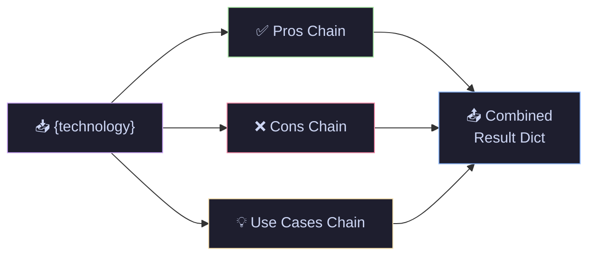
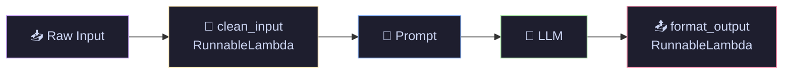
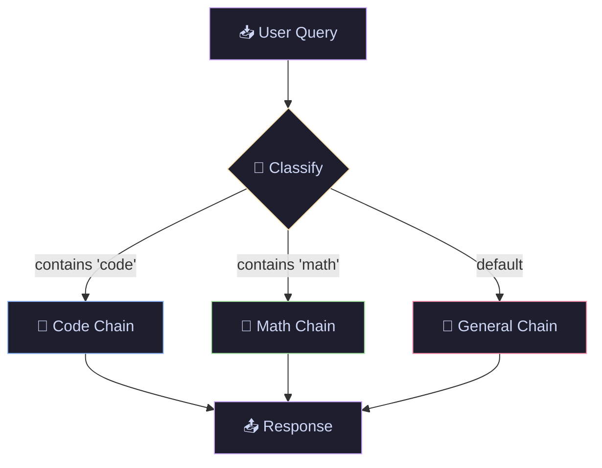

# 02 · LCEL Deep Dive — LangChain Expression Language

> Master the pipe operator and advanced composition patterns: parallel execution, routing, fallbacks, and custom logic injection.

---

## What You'll Learn

- **RunnablePassthrough** — forward inputs while enriching them with `.assign()`
- **RunnableParallel** — execute multiple chains simultaneously
- **RunnableLambda** — inject custom Python functions into chains
- **RunnableBranch** — route inputs to different chains conditionally
- **Fallbacks** — graceful model failure handling for production

## Quick Start

```bash
pip install langchain langchain-openai langchain-anthropic
```

```bash
jupyter notebook lcel_deep_dive.ipynb
```

---

## Core Concepts at a Glance

### ➡️ RunnablePassthrough — Carry Inputs Forward

Forward the original input while adding computed fields with `.assign()`:

```python
from langchain_core.runnables import RunnablePassthrough

summary_chain = prompt | llm | StrOutputParser()

# Keeps {topic} AND adds {summary}
chain = RunnablePassthrough.assign(
    summary=summary_chain
)

result = chain.invoke({"topic": "Transformer architecture"})
# result = {"topic": "Transformer architecture", "summary": "..."}
```


---

### ⚡ RunnableParallel — Fan-Out Execution

Run multiple chains on the same input at once. Each key becomes a field in the output:

```python
from langchain_core.runnables import RunnableParallel

analysis = RunnableParallel(
    pros=pros_prompt | llm | StrOutputParser(),
    cons=cons_prompt | llm | StrOutputParser(),
    use_cases=usecase_prompt | llm | StrOutputParser(),
)

result = analysis.invoke({"technology": "LangChain"})
# result = {"pros": "...", "cons": "...", "use_cases": "..."}
```



---

### 🔧 RunnableLambda — Custom Python Logic

Wrap any function as a chain component. Add preprocessing, validation, or transformation:

```python
from langchain_core.runnables import RunnableLambda

def clean_input(data: dict) -> dict:
    return {"query": data["query"].strip().lower()}

def format_output(text: str) -> dict:
    return {"answer": text, "char_count": len(text)}

# Full pipeline: preprocess → prompt → LLM → parse → postprocess
chain = (
    RunnableLambda(clean_input)
    | prompt
    | llm
    | StrOutputParser()
    | RunnableLambda(format_output)
)
```



---

### 🔀 RunnableBranch — Conditional Routing

Route inputs to specialized chains based on conditions. Like a switch statement:

```python
from langchain_core.runnables import RunnableBranch

router = RunnableBranch(
    # (condition, chain_to_run)
    (lambda x: "code" in x["query"].lower(),
     code_prompt | llm | StrOutputParser()),

    (lambda x: "math" in x["query"].lower(),
     math_prompt | llm | StrOutputParser()),

    # Default fallback
    general_prompt | llm | StrOutputParser(),
)
```



---

### 🛡️ Fallbacks — Production Resilience

If the primary model fails, automatically fall back to an alternative:

```python
primary = ChatOpenAI(model="gpt-4o-mini")
fallback = ChatAnthropic(model="claude-sonnet-4-20250514")

# If GPT fails → Claude answers instead
resilient_llm = primary.with_fallbacks([fallback])

chain = prompt | resilient_llm | StrOutputParser()
```


---

## Cheat Sheet

<table>
<tr>
<th>Runnable</th>
<th>Code</th>
<th>When to Use</th>
</tr>
<tr>
<td><b>Passthrough</b></td>
<td><code>RunnablePassthrough()</code></td>
<td>Forward input data unchanged</td>
</tr>
<tr>
<td><b>.assign()</b></td>
<td><code>RunnablePassthrough.assign(key=chain)</code></td>
<td>Enrich input with computed fields</td>
</tr>
<tr>
<td><b>Parallel</b></td>
<td><code>RunnableParallel(a=chain1, b=chain2)</code></td>
<td>Multiple analyses on same input</td>
</tr>
<tr>
<td><b>Lambda</b></td>
<td><code>RunnableLambda(my_function)</code></td>
<td>Custom pre/post processing</td>
</tr>
<tr>
<td><b>Branch</b></td>
<td><code>RunnableBranch((cond, chain), default)</code></td>
<td>Route to different chains by condition</td>
</tr>
<tr>
<td><b>Fallbacks</b></td>
<td><code>llm.with_fallbacks([backup_llm])</code></td>
<td>Graceful failure recovery</td>
</tr>
</table>

---

## File Structure

```
02-lcel-deep-dive/
├── README.md              ← you are here
└── lcel_deep_dive.ipynb   ← runnable notebook
```

## Navigation

⬅️ **[01 · LangChain Basics](../01-langchain-basics/)** · ➡️ **[03 · Output Parsers](../03-output-parsers/)**

---

<p align="center">
  Part of the <a href="https://github.com/hitpant/langchain-tutorials">LangChain Tutorials</a> series by <a href="https://github.com/hitpant">Hitesh Pant</a>
</p>
