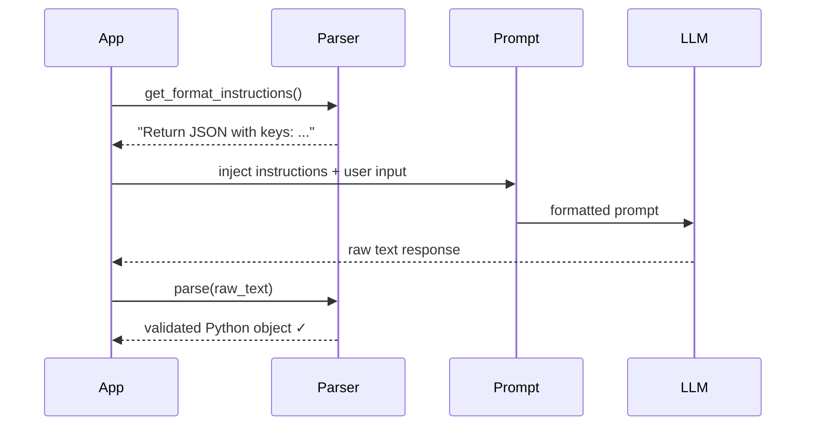
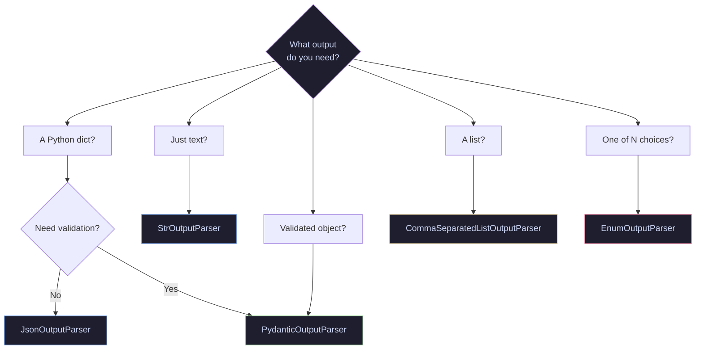
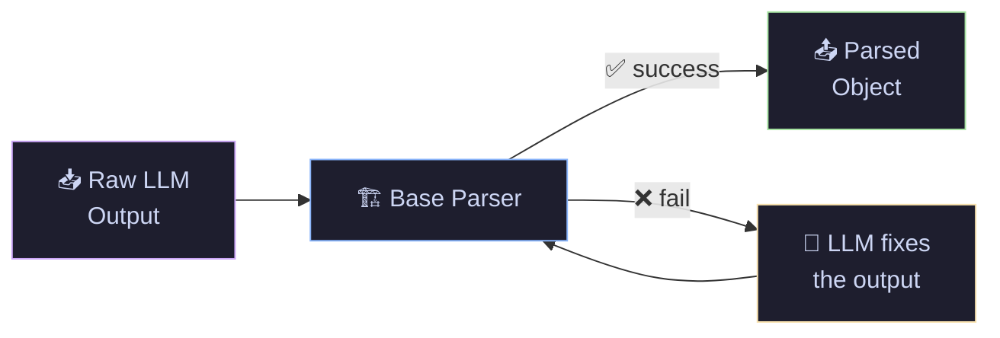

# 03 · Output Parsers — Structured Data from LLMs

> In Tutorials 01–02, every chain returned a raw string. But real apps need Python dicts, validated objects, lists, and enums. Output parsers sit at the end of a chain and convert LLM text into structured, typed data your code can actually use.

---

## What You'll Learn

- **StrOutputParser** — extract plain text from an AIMessage
- **JsonOutputParser** — get a Python dict from the LLM
- **PydanticOutputParser** — validated, typed objects with auto-generated format instructions
- **CommaSeparatedListOutputParser** — quick `list[str]` extraction
- **StructuredOutputParser** — schema-based parsing without Pydantic
- **EnumOutputParser** — force the LLM to pick from fixed choices
- **OutputFixingParser** — auto-repair malformed LLM output
- **`with_structured_output()`** — the modern shortcut (LangChain v0.2+)

## Quick Start

```bash
pip install langchain langchain-openai langchain-anthropic pydantic
```

```bash
jupyter notebook output_parsers.ipynb
```

---

## Core Concepts

### How Parsers Fit Into a Chain

Every parser does two things: (1) generate **format instructions** that tell the LLM how to respond, and (2) **parse** the raw text into a Python object.



### Which Parser Should I Use?



---

### 📤 StrOutputParser — The Default

**The Problem:** `llm.invoke()` returns an `AIMessage` object, not a plain string. If you try to concatenate it or pass it downstream, you get type errors.

**The Solution:** `StrOutputParser` extracts the `.content` string from the AIMessage. It's the simplest parser — use it when you just want the raw text.

```python
from langchain_core.output_parsers import StrOutputParser

# Without parser — returns an AIMessage object, not a string
raw = llm.invoke("What is RLHF?")
print(type(raw))   # <class 'AIMessage'> — not directly usable as text

# With parser — extracts the .content string automatically
chain = llm | StrOutputParser()
result = chain.invoke("What is RLHF?")
print(type(result))  # <class 'str'> — clean, usable text
```

**When to use:** Every chain where you want a plain string back. This is the parser you've been using in Tutorials 01–02.

---

### 📦 JsonOutputParser — Get a Python Dict

**The Problem:** You ask the LLM to return JSON, but `.invoke()` gives you a string that *looks* like JSON — not an actual Python dict. You'd have to manually `json.loads()` it every time.

**The Solution:** `JsonOutputParser` handles parsing + error handling for you. It also provides `get_format_instructions()` so the LLM knows exactly how to format its response.

```python
from langchain_core.output_parsers import JsonOutputParser

# Create the parser — it auto-generates instructions telling the LLM "respond in JSON"
parser = JsonOutputParser()

prompt = ChatPromptTemplate.from_messages([
    ("system", "You are a helpful assistant. {format_instructions}"),
    ("human", "Give me 3 facts about {topic}. Return as JSON with keys: fact_1, fact_2, fact_3")
])

# Chain: prompt → LLM → parser converts raw JSON text → Python dict
chain = prompt | llm | parser

result = chain.invoke({
    "topic": "black holes",
    "format_instructions": parser.get_format_instructions()  # injected into the prompt
})

print(type(result))      # <class 'dict'> — not a string, a real Python dict
print(result["fact_1"])   # access values directly like any dict
```

**When to use:** Quick structured output when you don't need type validation. For validated output, use PydanticOutputParser instead.

---

### 🏗️ PydanticOutputParser — Validated Structured Output

**The Problem:** `JsonOutputParser` gives you a dict, but doesn't validate types or enforce required fields. If the LLM returns `"rating": "eight"` instead of `"rating": 8`, your app crashes downstream — not at parse time.

**The Solution:** `PydanticOutputParser` uses your Pydantic model to (1) auto-generate detailed format instructions from the schema, and (2) validate + type-check the LLM's response. If the output doesn't match your model, it fails immediately with a clear error. Think of it as a strict contract between your code and the LLM.

```python
from langchain_core.output_parsers import PydanticOutputParser
from pydantic import BaseModel, Field
from typing import List

# Step 1: Define the exact structure you want back from the LLM
# Field(description=...) helps the LLM understand what each field expects
class MovieReview(BaseModel):
    title: str = Field(description="Name of the movie")
    rating: float = Field(description="Rating out of 10")
    pros: List[str] = Field(description="Positive aspects")
    cons: List[str] = Field(description="Negative aspects")
    verdict: str = Field(description="One-line recommendation")

# Step 2: Create the parser — it reads your model's schema automatically
parser = PydanticOutputParser(pydantic_object=MovieReview)

# Step 3: Build a prompt that includes {format_instructions}
# The parser injects JSON schema + formatting rules into this placeholder
prompt = ChatPromptTemplate.from_messages([
    ("system", "You are a film critic. {format_instructions}"),
    ("human", "Review the movie: {movie}")
])

# Step 4: Chain it — prompt → LLM → parser validates + converts → MovieReview object
chain = prompt | llm | parser
review = chain.invoke({
    "movie": "Inception",
    "format_instructions": parser.get_format_instructions()
})

# Result is a fully typed Pydantic object, not a string or dict
print(type(review))        # <class 'MovieReview'>
print(f"Title: {review.title}")    # "Inception"
print(f"Rating: {review.rating}")  # 9.0 (validated as float)
print(f"Pros: {review.pros}")      # ["Innovative concept", ...]
```


**When to use:** Any time you need reliable, typed structured output. This is the go-to parser for production chains.

---

### 📋 CommaSeparatedListOutputParser — Quick Lists

**The Problem:** You just need a simple Python list of strings. Using JSON or Pydantic for `["Django", "Flask", "FastAPI"]` is overkill.

**The Solution:** `CommaSeparatedListOutputParser` tells the LLM to return comma-separated values and splits them into a Python list.

```python
from langchain_core.output_parsers import CommaSeparatedListOutputParser

# Generates instructions like: "Return a comma-separated list"
parser = CommaSeparatedListOutputParser()

prompt = ChatPromptTemplate.from_template(
    "List 5 popular {category}. {format_instructions}"
)

chain = prompt | llm | parser

result = chain.invoke({
    "category": "Python web frameworks",
    "format_instructions": parser.get_format_instructions()
})

print(type(result))  # <class 'list'>
print(result)        # ['Django', 'Flask', 'FastAPI', 'Tornado', 'Bottle']
```

**When to use:** Simple list extraction — tags, categories, recommendations. Skip it if you need nested or typed data.

---

### 🗂️ StructuredOutputParser — Schema Without Pydantic

**The Problem:** You want structured key-value output but don't want to define a full Pydantic model for a one-off query.

**The Solution:** `StructuredOutputParser` lets you define a schema with simple `ResponseSchema` objects — just a name and description per field. Lighter than Pydantic, returns a plain dict.

```python
from langchain.output_parsers import StructuredOutputParser, ResponseSchema

# Define fields with just name + description — no Pydantic model needed
schemas = [
    ResponseSchema(name="summary", description="A 2-sentence summary"),
    ResponseSchema(name="difficulty", description="beginner, intermediate, or advanced"),
    ResponseSchema(name="time_to_learn", description="Estimated hours to learn"),
]

# Build the parser from your schemas
parser = StructuredOutputParser.from_response_schemas(schemas)

prompt = ChatPromptTemplate.from_template(
    "Describe the programming language {language}.\n{format_instructions}"
)

chain = prompt | llm | parser

result = chain.invoke({
    "language": "Rust",
    "format_instructions": parser.get_format_instructions()
})

print(type(result))  # <class 'dict'>
# result = {"summary": "Rust is...", "difficulty": "advanced", "time_to_learn": "200"}
```

**When to use:** Quick prototyping or one-off queries where a full Pydantic model feels heavy. For production, prefer PydanticOutputParser.

---

### 🎯 EnumOutputParser — Classification

**The Problem:** You need the LLM to classify text into one of N categories — but it keeps returning extra text like "The sentiment is positive" instead of just "positive".

**The Solution:** `EnumOutputParser` constrains the LLM to pick from a fixed set of enum values. Great for classification, routing, and any pick-one-from-N task.

```python
from langchain.output_parsers import EnumOutputParser
from enum import Enum

# Define the allowed choices — LLM must pick one of these, nothing else
class Sentiment(str, Enum):
    POSITIVE = "positive"
    NEGATIVE = "negative"
    NEUTRAL = "neutral"

# Parser constrains LLM output to only these enum values
parser = EnumOutputParser(enum=Sentiment)

prompt = ChatPromptTemplate.from_template(
    "Classify the sentiment of this text. Respond with ONLY one word.\n"
    "{format_instructions}\n\nText: {text}"
)

chain = prompt | llm | parser

result = chain.invoke({
    "text": "This product exceeded all my expectations!",
    "format_instructions": parser.get_format_instructions()
})

# Returns an actual Enum member, not a raw string
print(type(result))    # <enum 'Sentiment'>
print(result)          # Sentiment.POSITIVE  (enum member)
print(result.value)    # "positive"          (string value)
```

**When to use:** Sentiment analysis, intent classification, routing decisions, or any task where the output must be one of a fixed set.

---

### 🔧 OutputFixingParser — Self-Healing

**The Problem:** LLMs sometimes return malformed output — missing fields, wrong types, broken JSON. Your parser fails, and the entire chain crashes.

**The Solution:** `OutputFixingParser` wraps any parser. If parsing fails, it sends the error message + raw output back to the LLM and asks it to fix the formatting. It's an automatic retry loop — the LLM corrects its own mistakes.

```python
from langchain.output_parsers import OutputFixingParser

# Wrap any parser — if it fails, the LLM auto-corrects the output
fixing_parser = OutputFixingParser.from_llm(
    parser=base_parser,  # the parser that might fail (e.g. PydanticOutputParser)
    llm=llm              # LLM used to read the error and fix the output
)

# Flow: parse attempt → fails → sends error + raw output to LLM → LLM fixes → retry
# Example: '{"rating": "eight"}' → fails validation → LLM corrects to {"rating": 8}
fixed = fixing_parser.parse(malformed_output)
```



**When to use:** Production chains where you can't afford parse failures. Adds one extra LLM call only when parsing fails.

---

### ✨ with_structured_output — The Modern Way (v0.2+)

**The Problem:** The parser pattern works but has friction: create a parser, call `get_format_instructions()`, inject it into the prompt, pipe the parser at the end. Four steps for structured output.

**The Solution:** `with_structured_output()` binds a Pydantic model directly to the LLM. No separate parser, no format instructions, no manual wiring. Under the hood it uses OpenAI function calling / tool use — more reliable than prompt-based parsing.

```python
from pydantic import BaseModel, Field

# Same Pydantic model, but NO separate parser needed
class TechSummary(BaseModel):
    name: str = Field(description="Technology name")
    category: str = Field(description="Category: language, framework, tool, or platform")
    best_for: str = Field(description="Primary use case in one sentence")
    popularity: int = Field(description="Popularity score 1-10")

# Bind the schema directly to the LLM — handles formatting + parsing internally
# Uses function calling / tool use under the hood (more reliable than prompt injection)
structured_llm = llm.with_structured_output(TechSummary)

# invoke() now returns a TechSummary object directly — no format_instructions needed
result = structured_llm.invoke("Tell me about FastAPI")

print(type(result))        # <class 'TechSummary'>
print(f"Name: {result.name}")            # "FastAPI"
print(f"Category: {result.category}")    # "framework"
print(f"Popularity: {result.popularity}")  # 9
```

**When to use:** Default choice for new projects on LangChain v0.2+. Simpler, more reliable, fewer moving parts. Fall back to PydanticOutputParser only if your LLM doesn't support function calling.

---

## Cheat Sheet

<table>
<tr>
<th>Parser</th>
<th>Code</th>
<th>Returns</th>
<th>When to Use</th>
</tr>
<tr>
<td><b>StrOutputParser</b></td>
<td><code>StrOutputParser()</code></td>
<td><code>str</code></td>
<td>Default — raw text</td>
</tr>
<tr>
<td><b>JsonOutputParser</b></td>
<td><code>JsonOutputParser()</code></td>
<td><code>dict</code></td>
<td>Quick JSON extraction</td>
</tr>
<tr>
<td><b>PydanticOutputParser</b></td>
<td><code>PydanticOutputParser(pydantic_object=Model)</code></td>
<td>Pydantic model</td>
<td>Validated structured data</td>
</tr>
<tr>
<td><b>CommaSeparatedList</b></td>
<td><code>CommaSeparatedListOutputParser()</code></td>
<td><code>list[str]</code></td>
<td>Simple lists</td>
</tr>
<tr>
<td><b>StructuredOutputParser</b></td>
<td><code>StructuredOutputParser.from_response_schemas()</code></td>
<td><code>dict</code></td>
<td>Schema without Pydantic</td>
</tr>
<tr>
<td><b>EnumOutputParser</b></td>
<td><code>EnumOutputParser(enum=MyEnum)</code></td>
<td><code>Enum</code></td>
<td>Classification / fixed choices</td>
</tr>
<tr>
<td><b>OutputFixingParser</b></td>
<td><code>OutputFixingParser.from_llm(parser, llm)</code></td>
<td>varies</td>
<td>Auto-repair failed parses</td>
</tr>
<tr>
<td><b>with_structured_output</b></td>
<td><code>llm.with_structured_output(Model)</code></td>
<td>Pydantic model</td>
<td>Modern default (v0.2+)</td>
</tr>
</table>

---

## File Structure

```
03-output-parsers/
├── README.md              ← you are here
└── output_parsers.ipynb   ← runnable notebook with all 9 sections
```

## Navigation

⬅️ **[02 · LCEL Deep Dive](../02-lcel-deep-dive/)** · ➡️ **[04 · Document Loaders](../04-document-loaders/)**

---

<p align="center">
  Part of the <a href="https://github.com/hitpant/langchain-tutorials">LangChain Tutorials</a> series by <a href="https://github.com/hitpant">Hitesh Pant</a>
</p>
