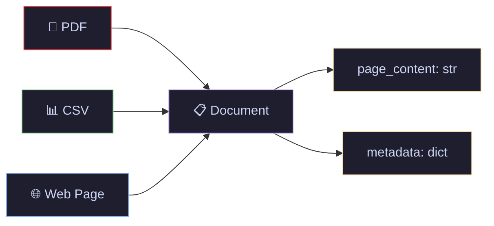
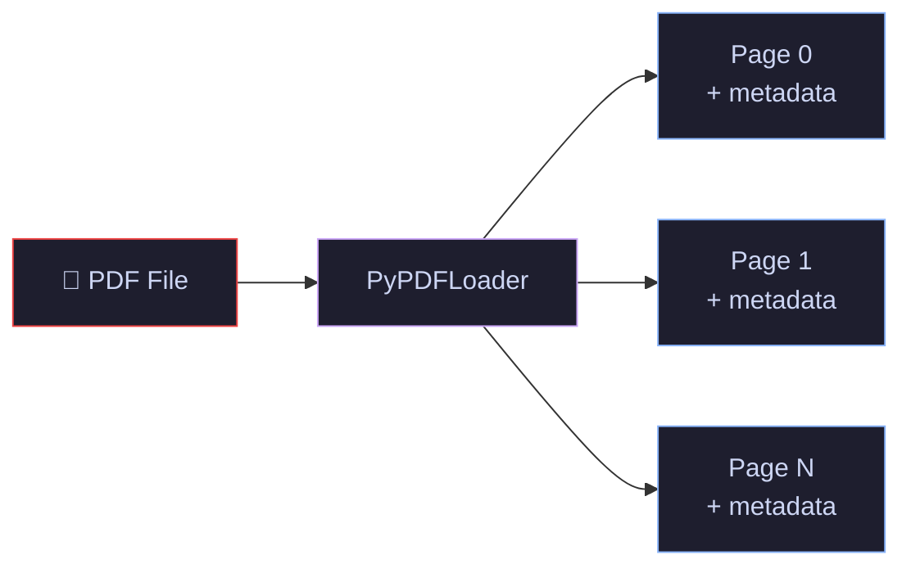
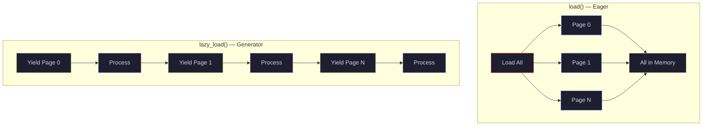

# 04 · Document Loaders — PDF, CSV & Web Ingestion

> Turn real-world files and web pages into LangChain `Document` objects — the first step in every RAG pipeline.

---

## What You'll Learn

- Load PDFs page-by-page with **PyPDFLoader**
- Parse CSV rows into individual documents with **CSVLoader**
- Scrape web pages into documents with **WebBaseLoader**
- Batch-load entire directories with **DirectoryLoader**
- Choose between `.load()` and `.lazy_load()` for memory efficiency
- Inspect and use **metadata** attached to every document

---

## Quick Start

```bash
pip install langchain langchain-community pypdf beautifulsoup4
```

```python
from langchain_community.document_loaders import PyPDFLoader

docs = PyPDFLoader("report.pdf").load()
print(docs[0].page_content[:200])
print(docs[0].metadata)
```

---

## Core Concepts

### 1 · The Document Object

**The Problem** — LLMs only understand text. Your data lives in PDFs, spreadsheets, web pages, and dozens of other formats.

**The Solution** — Every loader outputs a standardized `Document` object with two fields: `page_content` (the text) and `metadata` (source, page number, etc.).

> **Analogy:** A Document object is like a library index card — one side has the content, the other side has where it came from (source, page, date). Every card follows the same format regardless of whether the original was a book, magazine, or newspaper.

```python
from langchain_core.documents import Document

# This is what every loader produces
doc = Document(
    page_content="Transformers use self-attention...",  # the actual text
    metadata={"source": "paper.pdf", "page": 0}        # provenance info
)
```



> **Key insight:** The standardized Document format is what makes the entire LangChain pipeline modular — loaders, splitters, embeddings, and vector stores all speak the same language.

---

### 2 · PyPDFLoader — Loading PDFs

**The Problem** — PDFs have complex internal structures (fonts, columns, tables). Extracting clean text isn't as simple as reading a `.txt` file.

**The Solution** — `PyPDFLoader` uses the `pypdf` library to extract text page-by-page. Each page becomes its own `Document` with page number in metadata.

> **Analogy:** Think of PyPDFLoader as a photocopy machine that takes a bound book, separates each page, and stamps the page number on the back of each copy.

```python
from langchain_community.document_loaders import PyPDFLoader

# Each page becomes a separate Document object
loader = PyPDFLoader("attention_is_all_you_need.pdf")
docs = loader.load()

print(f"Total pages: {len(docs)}")            # one Document per page
print(f"Page 1 text: {docs[0].page_content[:100]}...")
print(f"Metadata: {docs[0].metadata}")
# → {'source': 'attention_is_all_you_need.pdf', 'page': 0}
```



> **When to use:** Text-based PDFs with straightforward layouts. For scanned PDFs or complex multi-column layouts, consider `UnstructuredPDFLoader` or `PyMuPDFLoader` instead.

---

### 3 · CSVLoader — Loading Spreadsheets

**The Problem** — CSV files contain structured, row-based data. You need each row as a searchable document while preserving column context.

**The Solution** — `CSVLoader` converts each row into a `Document`. Column names are included in `page_content` as key-value pairs, and the source file + row number land in metadata.

> **Analogy:** CSVLoader is like tearing a spreadsheet into individual flashcards — one card per row, with column headers printed on each card so the row makes sense on its own.

```python
from langchain_community.document_loaders import CSVLoader

# Each row becomes a separate Document
loader = CSVLoader(
    file_path="employees.csv",
    csv_args={
        "delimiter": ",",         # comma-separated (default)
        "quotechar": '"',         # handle quoted fields
    }
)
docs = loader.load()

print(f"Total rows: {len(docs)}")
print(f"Row 1:\n{docs[0].page_content}")
# → "name: Alice\nrole: Engineer\ndepartment: ML"
print(f"Metadata: {docs[0].metadata}")
# → {'source': 'employees.csv', 'row': 0}
```

```python
# Source column — use a specific column as the metadata source field
loader = CSVLoader(
    file_path="employees.csv",
    source_column="name"          # metadata['source'] = employee name
)
docs = loader.load()
print(docs[0].metadata)
# → {'source': 'Alice', 'row': 0}
```

> **When to use:** Any tabular data — employee records, product catalogs, FAQ lists. Each row becomes independently searchable in a vector store.

---

### 4 · WebBaseLoader — Loading Web Pages

**The Problem** — Web pages contain useful content buried under navigation bars, footers, ads, and HTML tags. You need just the text.

**The Solution** — `WebBaseLoader` fetches a URL and uses BeautifulSoup to extract text content. You can target specific HTML elements to get cleaner output.

> **Analogy:** WebBaseLoader is like a research assistant who visits a webpage, strips away the ads and navigation, and hands you a clean printout of the article text.

```python
from langchain_community.document_loaders import WebBaseLoader

# Basic — loads the full page text
loader = WebBaseLoader("https://lilianweng.github.io/posts/2023-06-23-agent/")
docs = loader.load()

print(f"Content length: {len(docs[0].page_content)} chars")
print(f"First 200 chars:\n{docs[0].page_content[:200]}")
print(f"Metadata: {docs[0].metadata}")
# → {'source': 'https://...', 'title': '...', 'language': 'en'}
```

```python
import bs4
from langchain_community.document_loaders import WebBaseLoader

# Targeted — only extract content from specific HTML elements
loader = WebBaseLoader(
    web_paths=["https://lilianweng.github.io/posts/2023-06-23-agent/"],
    bs_kwargs=dict(
        parse_only=bs4.SoupStrainer(
            class_=("post-content", "post-title", "post-header")
        )
    ),
)
docs = loader.load()
# Much cleaner — no navbars, footers, or sidebar content
```


> **When to use:** Blogs, documentation, news articles — any static page. Does **not** handle JavaScript-rendered content (SPAs). For dynamic sites, look into `PlaywrightURLLoader` or `SeleniumURLLoader`.

---

### 5 · DirectoryLoader — Batch Loading Files

**The Problem** — You have a folder full of PDFs (or CSVs, or text files) and need to load them all in one shot.

**The Solution** — `DirectoryLoader` walks a directory and loads every matching file using a specified loader class. Use `glob` patterns to filter file types.

> **Analogy:** DirectoryLoader is a librarian who walks through an entire shelf, picks up every book of a certain type, and processes each one using the right reader.

```python
from langchain_community.document_loaders import DirectoryLoader, PyPDFLoader

# Load all PDFs from a directory
loader = DirectoryLoader(
    path="./documents/",           # folder to scan
    glob="**/*.pdf",               # match all PDFs, including subdirectories
    loader_cls=PyPDFLoader,        # use PyPDFLoader for each file
    show_progress=True             # progress bar for large directories
)
docs = loader.load()
print(f"Loaded {len(docs)} pages from all PDFs")
```

> **When to use:** Processing document collections — research papers, legal contracts, support tickets. Combine with different `loader_cls` values for mixed-format directories.

---

### 6 · load() vs lazy_load() — Memory Management

**The Problem** — `.load()` pulls everything into memory at once. With hundreds of large PDFs, you'll run out of RAM.

**The Solution** — `.lazy_load()` returns a generator that yields one `Document` at a time, processing files incrementally without loading the entire corpus into memory.

> **Analogy:** `.load()` is filling your entire shopping cart before checkout. `.lazy_load()` is a conveyor belt — items arrive one at a time and you process each before the next appears.

```python
from langchain_community.document_loaders import PyPDFLoader

loader = PyPDFLoader("large_report.pdf")

# Eager — loads ALL pages into memory at once
all_docs = loader.load()

# Lazy — yields one page at a time (memory efficient)
for doc in loader.lazy_load():
    # Process each page individually
    print(f"Page {doc.metadata['page']}: {len(doc.page_content)} chars")
```



> **Key insight:** Default to `.load()` for prototyping and small datasets. Switch to `.lazy_load()` when working with large document collections in production.

---

## Cheat Sheet

<table>
<tr>
<th>Loader</th>
<th>Code</th>
<th>Returns</th>
<th>When to Use</th>
</tr>
<tr>
<td><b>PyPDFLoader</b></td>
<td><code>PyPDFLoader("file.pdf")</code></td>
<td>1 Doc per page</td>
<td>Text-based PDFs</td>
</tr>
<tr>
<td><b>CSVLoader</b></td>
<td><code>CSVLoader("file.csv")</code></td>
<td>1 Doc per row</td>
<td>Tabular data, FAQs, catalogs</td>
</tr>
<tr>
<td><b>WebBaseLoader</b></td>
<td><code>WebBaseLoader("https://...")</code></td>
<td>1 Doc per URL</td>
<td>Static web pages, blogs, docs</td>
</tr>
<tr>
<td><b>DirectoryLoader</b></td>
<td><code>DirectoryLoader("./dir/", glob="*.pdf", loader_cls=PyPDFLoader)</code></td>
<td>Docs from all files</td>
<td>Batch loading entire folders</td>
</tr>
<tr>
<td><b>.load()</b></td>
<td><code>loader.load()</code></td>
<td><code>list[Document]</code></td>
<td>Small datasets, prototyping</td>
</tr>
<tr>
<td><b>.lazy_load()</b></td>
<td><code>loader.lazy_load()</code></td>
<td><code>Generator[Document]</code></td>
<td>Large datasets, production</td>
</tr>
</table>

---

## File Structure

```
04-document-loaders/
├── README.md                ← you are here
└── document_loaders.ipynb   ← runnable notebook with all sections
```

## Navigation

⬅️ **[03 · Output Parsers](../03-output-parsers/)** · ➡️ **[05 · Text Splitters](../05-text-splitters/)**

---

<p align="center">
  Part of the <a href="https://github.com/hitpant/langchain-tutorials">LangChain Tutorials</a> series by <a href="https://github.com/hitpant">Hitesh Pant</a>
</p>
