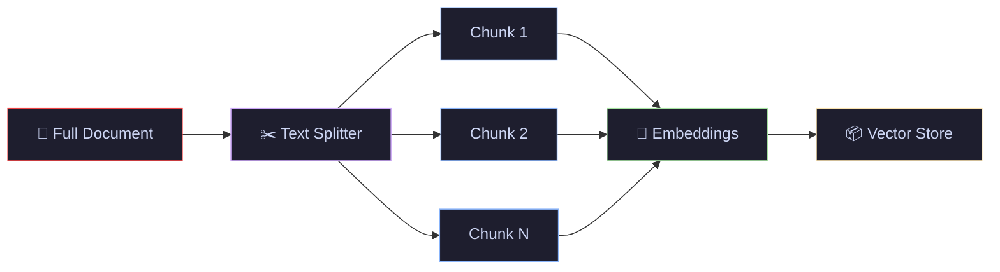
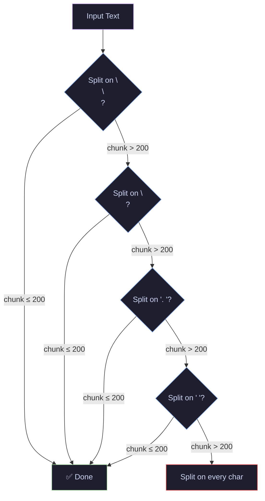
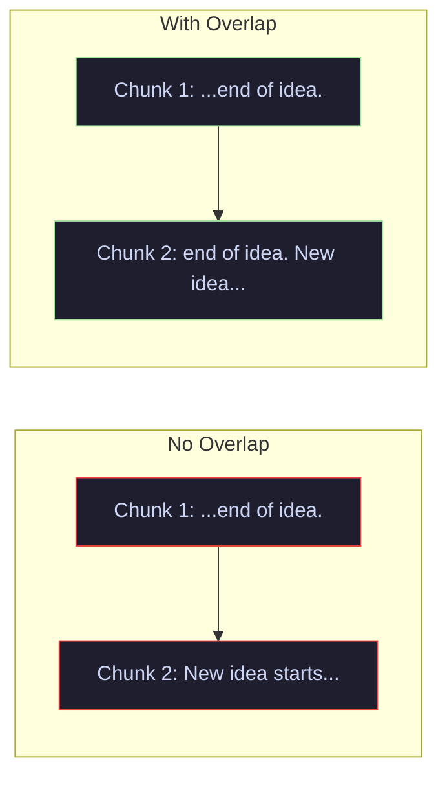
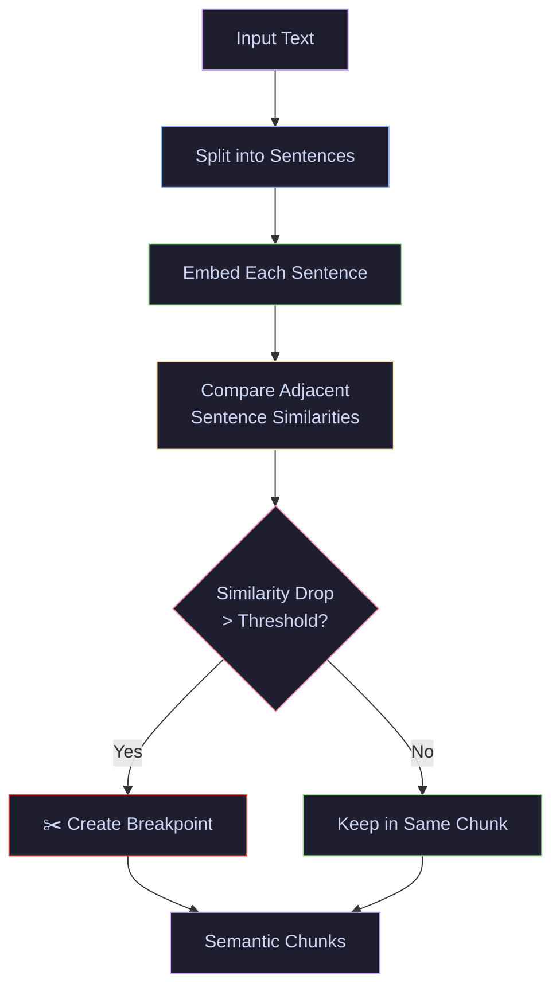
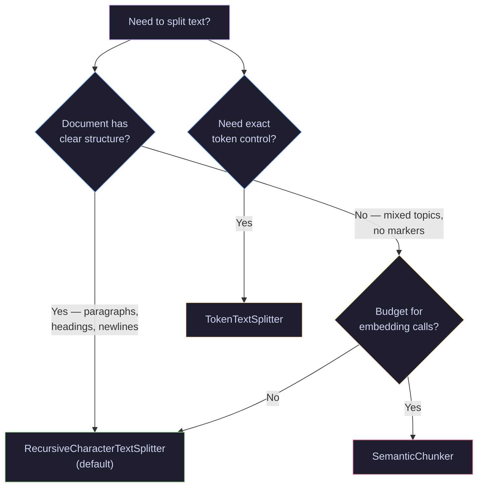

# 05 · Text Splitters — Recursive, Token & Semantic Chunking

> Break documents into LLM-friendly chunks that preserve meaning — the bridge between loading and embedding.

---

## What You'll Learn

- Split text using **RecursiveCharacterTextSplitter** — the recommended default
- Understand **chunk_size** and **chunk_overlap** and how to tune them
- Use **TokenTextSplitter** to chunk by token count instead of characters
- Apply **SemanticChunker** for meaning-aware splitting using embeddings
- Compare all three strategies side-by-side on the same document
- Connect the full pipeline: **load → split → (embed)**

---

## Quick Start

```bash
pip install langchain langchain-text-splitters langchain-experimental langchain-openai tiktoken
```

```python
from langchain_text_splitters import RecursiveCharacterTextSplitter

splitter = RecursiveCharacterTextSplitter(chunk_size=500, chunk_overlap=50)
chunks = splitter.split_text(long_document)
```

---

## Core Concepts

### 1 · Why Split Text?

**The Problem** — LLMs have token limits. A 100-page PDF won't fit in a single prompt. Even if it did, more input tokens = higher cost and diluted attention.

**The Solution** — Split documents into smaller chunks that fit the model's context window. Each chunk gets embedded independently, and only the relevant chunks are retrieved at query time.

> **Analogy:** Splitting is like cutting a textbook into index cards. You don't hand someone the entire book when they ask a question — you hand them the 3 most relevant cards.



> **Key insight:** How you split directly affects retrieval quality. Bad chunks = bad retrieval = bad LLM answers. Text splitting is not an afterthought — it's a critical design decision.

---

### 2 · RecursiveCharacterTextSplitter — The Default

**The Problem** — Naive splitting (every N characters) cuts sentences mid-word, destroying meaning.

**The Solution** — `RecursiveCharacterTextSplitter` tries to split on natural boundaries in order: paragraphs (`\n\n`) → newlines (`\n`) → sentences (`. `) → spaces (` `) → characters (`""`). It only falls back to smaller separators when larger ones produce chunks that exceed `chunk_size`.

> **Analogy:** Like a careful editor who first tries to break at chapter boundaries, then at paragraph breaks, then at sentence ends — always preferring the cleanest cut that keeps meaning intact.

```python
from langchain_text_splitters import RecursiveCharacterTextSplitter

splitter = RecursiveCharacterTextSplitter(
    chunk_size=200,         # max characters per chunk
    chunk_overlap=30,       # characters shared between consecutive chunks
    separators=["\n\n", "\n", ". ", " ", ""],  # default hierarchy
    length_function=len,    # how to measure chunk size (default: character count)
)

chunks = splitter.split_text(long_text)
```



> **When to use:** The recommended default for most RAG applications. Start here and only move to more advanced strategies if retrieval metrics demand it.

---

### 3 · chunk_size and chunk_overlap — Tuning the Split

**The Problem** — Chunks that are too large waste context window space. Chunks that are too small lose important context.

**The Solution** — `chunk_size` controls the maximum characters (or tokens) per chunk. `chunk_overlap` controls how many characters are shared between consecutive chunks, preserving context across boundaries.

> **Analogy:** `chunk_size` is how big each index card is. `chunk_overlap` is writing the last sentence of one card onto the top of the next — so ideas that span a boundary don't get lost.

```python
# Small chunks — precise retrieval, less context
splitter_small = RecursiveCharacterTextSplitter(chunk_size=200, chunk_overlap=20)

# Large chunks — more context, less precision
splitter_large = RecursiveCharacterTextSplitter(chunk_size=1000, chunk_overlap=100)

# Rule of thumb: overlap = 10-20% of chunk_size
```



> **Key insight:** There is no universal best `chunk_size`. It depends on your embedding model, retrieval strategy, and document type. Benchmark with your actual data.

---

### 4 · TokenTextSplitter — Chunk by Token Count

**The Problem** — LLMs count tokens, not characters. A chunk of 500 characters might be 100 tokens or 200 tokens depending on the language and vocabulary.

**The Solution** — `TokenTextSplitter` measures chunk size in tokens using the model's actual tokenizer (tiktoken for OpenAI models). This ensures chunks align with model token limits.

> **Analogy:** If characters are letters and tokens are words, `RecursiveCharacterTextSplitter` measures by letter count while `TokenTextSplitter` measures by word count. The word count is what the LLM actually cares about.

```python
from langchain_text_splitters import TokenTextSplitter

splitter = TokenTextSplitter(
    chunk_size=200,          # max TOKENS per chunk (not characters)
    chunk_overlap=20,        # token overlap
    encoding_name="cl100k_base"  # tokenizer used by GPT-4o, GPT-4o-mini
)

chunks = splitter.split_text(long_text)
```

> **When to use:** When you need precise control over token counts — e.g., fitting chunks into a fixed-size context window or managing API costs.

---

### 5 · SemanticChunker — Meaning-Aware Splitting

**The Problem** — Character and token splitters are blind to meaning. A paragraph about two different topics might stay in one chunk, while a coherent idea might get split across two.

**The Solution** — `SemanticChunker` uses an embedding model to measure semantic similarity between sentences. It creates breakpoints where the meaning shifts, producing chunks that are topically coherent.

> **Analogy:** Instead of cutting a book every 500 words, you read it and cut at the point where the author changes topics — regardless of how many words that takes.

```python
from langchain_experimental.text_splitter import SemanticChunker
from langchain_openai import OpenAIEmbeddings

splitter = SemanticChunker(
    embeddings=OpenAIEmbeddings(),
    breakpoint_threshold_type="percentile",  # percentile | standard_deviation | interquartile | gradient
    breakpoint_threshold_amount=90,          # split at 90th percentile of similarity drops
)

chunks = splitter.create_documents([long_text])
```



> **When to use:** Documents with multiple interleaved topics and no clear structural markers. Be aware of the tradeoff: it requires embedding API calls for every sentence, adding latency and cost. Start with `RecursiveCharacterTextSplitter` and upgrade to semantic chunking only if retrieval quality demands it.

---

### 6 · Choosing the Right Splitter



---

## Cheat Sheet

<table>
<tr>
<th>Splitter</th>
<th>Code</th>
<th>Measures By</th>
<th>When to Use</th>
</tr>
<tr>
<td><b>RecursiveCharacter</b></td>
<td><code>RecursiveCharacterTextSplitter(chunk_size=500, chunk_overlap=50)</code></td>
<td>Characters</td>
<td>Default for most RAG pipelines</td>
</tr>
<tr>
<td><b>Token</b></td>
<td><code>TokenTextSplitter(chunk_size=200, chunk_overlap=20)</code></td>
<td>Tokens (tiktoken)</td>
<td>Precise token budget control</td>
</tr>
<tr>
<td><b>Semantic</b></td>
<td><code>SemanticChunker(embeddings, breakpoint_threshold_type="percentile")</code></td>
<td>Embedding similarity</td>
<td>Multi-topic docs, no structure</td>
</tr>
<tr>
<td><b>chunk_size</b></td>
<td><code>chunk_size=500</code></td>
<td>—</td>
<td>Larger = more context, less precision</td>
</tr>
<tr>
<td><b>chunk_overlap</b></td>
<td><code>chunk_overlap=50</code></td>
<td>—</td>
<td>10-20% of chunk_size recommended</td>
</tr>
</table>

---

## File Structure

```
05-text-splitters/
├── README.md               ← you are here
└── text_splitters.ipynb    ← runnable notebook with all sections
```

## Navigation

⬅️ **[04 · Document Loaders](../04-document-loaders/)** · ➡️ **[06 · RAG + FAISS](../06-rag-faiss/)**

---

<p align="center">
  Part of the <a href="https://github.com/hitpant/langchain-tutorials">LangChain Tutorials</a> series by <a href="https://github.com/hitpant">Hitesh Pant</a>
</p>
