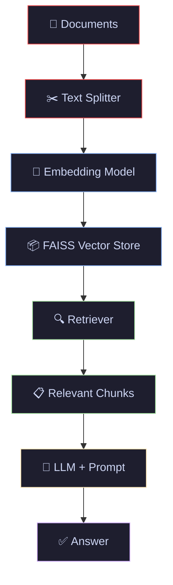
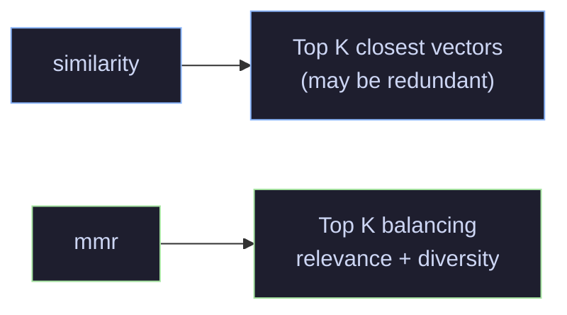
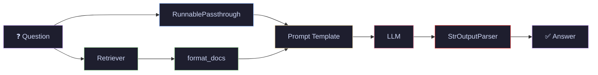

# 06 · RAG with FAISS — Retrieval-Augmented Generation

> Build your first RAG pipeline — load documents, embed them, store in FAISS, retrieve relevant chunks, and generate grounded answers.

---

## What You'll Learn

- Understand the **RAG architecture** and why it matters
- Generate **embeddings** with OpenAI's embedding model
- Build a **FAISS vector store** from documents
- Convert a vector store into a **retriever**
- Wire a complete **RAG chain** (retriever + LLM) using LCEL
- Compare **similarity search** vs **MMR** (Maximal Marginal Relevance)
- **Save and load** FAISS indexes to disk

---

## Quick Start

```bash
pip install langchain langchain-openai langchain-community faiss-cpu
```

```python
from langchain_community.vectorstores import FAISS
from langchain_openai import OpenAIEmbeddings

vectorstore = FAISS.from_documents(chunks, OpenAIEmbeddings())
results = vectorstore.similarity_search("What is self-attention?", k=3)
```

---

## Core Concepts

### 1 · What is RAG?

**The Problem** — LLMs have a knowledge cutoff and can hallucinate. They can't access your private documents, internal wikis, or latest data.

**The Solution** — Retrieval-Augmented Generation retrieves relevant context from your own documents and passes it to the LLM alongside the question. The model generates answers grounded in your data instead of relying solely on its training.

> **Analogy:** RAG is like an open-book exam. Instead of answering from memory (which might be wrong), you look up the relevant pages first, then write your answer using those pages as evidence.


> **Key insight:** RAG separates knowledge from reasoning. The retriever handles "what do we know" and the LLM handles "how do we answer." This makes the system updatable (just add new documents) without retraining the model.

---

### 2 · The Full RAG Pipeline

Every RAG system follows the same pattern: **load → split → embed → store → retrieve → generate**.



Tutorials 04 and 05 covered the first two steps (load + split). This tutorial covers the remaining four: **embed → store → retrieve → generate**.

---

### 3 · Embeddings — Text to Vectors

**The Problem** — Computers can't measure "similarity" between raw text strings. You need a numerical representation that captures meaning.

**The Solution** — Embedding models convert text into high-dimensional vectors where semantically similar texts are close together in vector space.

> **Analogy:** Embeddings are like GPS coordinates for meaning. "King" and "Queen" are close on the map. "King" and "Refrigerator" are far apart.

```python
from langchain_openai import OpenAIEmbeddings

embeddings = OpenAIEmbeddings(model="text-embedding-3-small")

# Embed a single text → returns a list of floats
vector = embeddings.embed_query("What is self-attention?")
print(f"Dimensions: {len(vector)}")  # 1536 for text-embedding-3-small
```

> **When to use:** OpenAI embeddings for quick prototyping. For production or cost-sensitive use, consider open-source alternatives like `sentence-transformers/all-MiniLM-L6-v2`.

---

### 4 · FAISS Vector Store — Store and Search

**The Problem** — You have thousands of embedding vectors. You need to find the most similar ones to a query vector in milliseconds.

**The Solution** — FAISS (Facebook AI Similarity Search) is an in-memory library for fast nearest-neighbor search over dense vectors. LangChain wraps it with a simple API.

> **Analogy:** FAISS is like a library catalog system optimized for "find me the 3 books most similar to this topic" — except it searches through millions of entries in milliseconds.

```python
from langchain_community.vectorstores import FAISS
from langchain_openai import OpenAIEmbeddings

# Build vector store from documents (embed + store in one step)
vectorstore = FAISS.from_documents(chunks, OpenAIEmbeddings())

# Search for similar documents
results = vectorstore.similarity_search("What is self-attention?", k=3)
```

```python
# Similarity search with scores (lower = more similar for L2 distance)
results_with_scores = vectorstore.similarity_search_with_score("attention mechanism", k=3)
for doc, score in results_with_scores:
    print(f"Score: {score:.4f} | {doc.page_content[:80]}...")
```

---

### 5 · Retriever — Vector Store as a Chain Component

**The Problem** — A vector store has a `.similarity_search()` method, but LCEL chains expect a `Retriever` interface.

**The Solution** — `.as_retriever()` wraps the vector store so it can plug directly into an LCEL chain.

```python
# Basic retriever — returns top k most similar documents
retriever = vectorstore.as_retriever(search_kwargs={"k": 3})

# MMR retriever — balances relevance with diversity
retriever_mmr = vectorstore.as_retriever(
    search_type="mmr",
    search_kwargs={"k": 3, "fetch_k": 10}  # fetch 10, return most diverse 3
)
```



> **Key insight:** Use `similarity` for precise factual lookup. Use `mmr` when you want diverse context — e.g., a question that touches multiple topics.

---

### 6 · RAG Chain — Retriever + LLM

**The Problem** — You have a retriever and an LLM. You need to wire them together: retrieve context, format a prompt, and generate an answer.

**The Solution** — LCEL pipes the retriever output into a prompt template alongside the question, then passes both to the LLM.

```python
from langchain_openai import ChatOpenAI
from langchain_core.prompts import ChatPromptTemplate
from langchain_core.output_parsers import StrOutputParser
from langchain_core.runnables import RunnablePassthrough

# Format retrieved docs into a single context string
def format_docs(docs):
    return "\n\n".join(doc.page_content for doc in docs)

prompt = ChatPromptTemplate.from_template("""
Answer the question based only on the following context:

{context}

Question: {question}
""")

llm = ChatOpenAI(model="gpt-4o-mini", temperature=0)

# The RAG chain
rag_chain = (
    {"context": retriever | format_docs, "question": RunnablePassthrough()}
    | prompt
    | llm
    | StrOutputParser()
)

answer = rag_chain.invoke("What is self-attention?")
```



---

### 7 · Save and Load — Persisting the Index

**The Problem** — FAISS is in-memory. When your script stops, the index is gone. Re-embedding thousands of documents every time is expensive.

**The Solution** — Save the FAISS index to disk and reload it later without re-computing embeddings.

```python
# Save to disk
vectorstore.save_local("faiss_index")

# Load from disk (no re-embedding needed)
loaded_store = FAISS.load_local(
    "faiss_index",
    OpenAIEmbeddings(),
    allow_dangerous_deserialization=True  # required flag
)
```

> **When to use:** Always save your index after building it. Load from disk in production instead of re-embedding on every startup.

---

## Cheat Sheet

<table>
<tr>
<th>Component</th>
<th>Code</th>
<th>What It Does</th>
</tr>
<tr>
<td><b>Embeddings</b></td>
<td><code>OpenAIEmbeddings()</code></td>
<td>Converts text → vectors</td>
</tr>
<tr>
<td><b>Vector Store</b></td>
<td><code>FAISS.from_documents(docs, embeddings)</code></td>
<td>Stores vectors, enables search</td>
</tr>
<tr>
<td><b>Similarity Search</b></td>
<td><code>vectorstore.similarity_search(query, k=3)</code></td>
<td>Find top K most similar docs</td>
</tr>
<tr>
<td><b>Retriever</b></td>
<td><code>vectorstore.as_retriever()</code></td>
<td>Chain-compatible search interface</td>
</tr>
<tr>
<td><b>MMR Search</b></td>
<td><code>.as_retriever(search_type="mmr")</code></td>
<td>Relevant + diverse results</td>
</tr>
<tr>
<td><b>RAG Chain</b></td>
<td><code>{"context": retriever | format_docs, "question": RunnablePassthrough()} | prompt | llm</code></td>
<td>End-to-end question answering</td>
</tr>
<tr>
<td><b>Save Index</b></td>
<td><code>vectorstore.save_local("path")</code></td>
<td>Persist to disk</td>
</tr>
<tr>
<td><b>Load Index</b></td>
<td><code>FAISS.load_local("path", embeddings)</code></td>
<td>Reload without re-embedding</td>
</tr>
</table>

---

## File Structure

```
06-rag-faiss/
├── README.md           ← you are here
└── rag_faiss.ipynb     ← runnable notebook with full pipeline
```
---

<p align="center">
  Part of the <a href="https://github.com/hitpant/langchain-tutorials">LangChain Tutorials</a> series by <a href="https://github.com/hitpant">Hitesh Pant</a>
</p>
