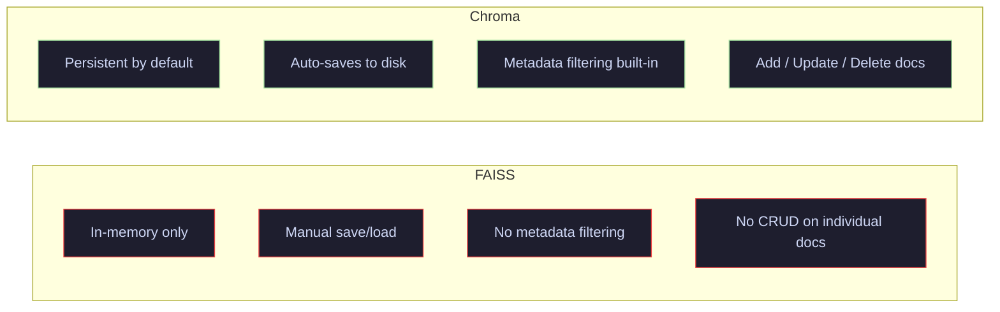

# 07 · RAG with Chroma — Persistent Vector Store

> Level up from FAISS — add built-in persistence, metadata filtering, and collection management to your RAG pipeline.

---

## What You'll Learn

- Set up a **persistent Chroma** vector store that survives restarts
- Use **named collections** to organize different document sets
- **Filter by metadata** during retrieval (source, page, topic, etc.)
- Perform **CRUD operations** — add, update, and delete documents
- Build a **RAG chain** with Chroma as the retriever
- Compare **FAISS vs Chroma** — when to use which

---

## Quick Start

```bash
pip install langchain langchain-openai langchain-chroma chromadb
```

```python
from langchain_chroma import Chroma
from langchain_openai import OpenAIEmbeddings

vectorstore = Chroma.from_documents(
    chunks,
    OpenAIEmbeddings(),
    persist_directory="./chroma_db",
    collection_name="my_docs"
)
```

---

## Core Concepts

### 1 · FAISS vs Chroma — Why Chroma?

**The Problem** — FAISS is in-memory. You have to manually save/load indexes, can't filter by metadata, and there's no built-in way to update or delete individual documents.

**The Solution** — Chroma provides built-in persistence, metadata filtering, collection management, and CRUD operations out of the box. Same RAG pattern, more production-ready features.

> **Analogy:** FAISS is like a spreadsheet of vectors — fast and simple but no structure. Chroma is a proper database — it persists to disk, supports queries with filters, and lets you manage documents individually.



> **Key insight:** Use FAISS for quick prototyping. Switch to Chroma when you need persistence, metadata filtering, or document management.

---

### 2 · Persistent Vector Store

**The Problem** — Rebuilding the vector store from scratch on every startup wastes time and embedding API costs.

**The Solution** — Pass a `persist_directory` to Chroma. Documents are written to disk automatically and reloaded on next initialization.

```python
from langchain_chroma import Chroma
from langchain_openai import OpenAIEmbeddings

# First run — creates the database on disk
vectorstore = Chroma.from_documents(
    documents=chunks,
    embedding=OpenAIEmbeddings(),
    persist_directory="./chroma_db",
    collection_name="ml_knowledge"
)

# Subsequent runs — loads from disk (no re-embedding)
vectorstore = Chroma(
    persist_directory="./chroma_db",
    embedding_function=OpenAIEmbeddings(),
    collection_name="ml_knowledge"
)
```

---

### 3 · Metadata Filtering

**The Problem** — Similarity search returns the closest vectors, but you might only want results from a specific source, page, or topic.

**The Solution** — Chroma supports `where` clauses that filter on metadata before or during similarity search.

```python
# Filter by source
results = vectorstore.similarity_search(
    "attention mechanism",
    k=3,
    filter={"source": "transformers.pdf"}
)

# Filter with operators
results = vectorstore.similarity_search(
    "training techniques",
    k=3,
    filter={"page": {"$gte": 2}}   # page >= 2
)
```


> **When to use:** Multi-source knowledge bases — filter by document type, date range, department, or any custom tag. Especially useful when different document sources have different reliability levels.

---

### 4 · CRUD Operations — Managing Documents

**The Problem** — Knowledge bases change. Documents get updated, corrected, or deprecated. You need to modify the vector store without rebuilding from scratch.

**The Solution** — Chroma supports add, update, and delete operations on individual documents by ID.

```python
# Add new documents
vectorstore.add_documents(new_docs, ids=["doc_1", "doc_2"])

# Update existing document
vectorstore.update_documents(ids=["doc_1"], documents=[updated_doc])

# Delete by ID
vectorstore.delete(ids=["doc_2"])
```

> **Key insight:** FAISS requires rebuilding the entire index for changes. Chroma lets you surgically add, update, or remove individual documents.

---

### 5 · RAG Chain with Chroma

Same LCEL pattern as Tutorial 06 — the only difference is the retriever source.

```python
retriever = vectorstore.as_retriever(
    search_type="mmr",
    search_kwargs={"k": 3, "fetch_k": 10}
)

rag_chain = (
    {"context": retriever | format_docs, "question": RunnablePassthrough()}
    | prompt
    | llm
    | StrOutputParser()
)
```

---

### 6 · Retriever with Metadata Filter

**The Problem** — You want the RAG chain to only search within a specific subset of documents.

**The Solution** — Pass `filter` inside `search_kwargs` when creating the retriever.

```python
# Retriever that only searches within a specific source
retriever = vectorstore.as_retriever(
    search_kwargs={
        "k": 3,
        "filter": {"source": "transformers.pdf"}
    }
)
```

> **When to use:** Multi-tenant apps, role-based access, or when different questions should search different document subsets.

---

## Cheat Sheet

<table>
<tr>
<th>Feature</th>
<th>FAISS</th>
<th>Chroma</th>
</tr>
<tr>
<td><b>Persistence</b></td>
<td>Manual <code>save_local()</code> / <code>load_local()</code></td>
<td>Built-in via <code>persist_directory</code></td>
</tr>
<tr>
<td><b>Metadata Filtering</b></td>
<td>Not supported</td>
<td><code>filter={"key": "value"}</code></td>
</tr>
<tr>
<td><b>CRUD</b></td>
<td>Rebuild index</td>
<td><code>add / update / delete</code> by ID</td>
</tr>
<tr>
<td><b>Collections</b></td>
<td>One index per file</td>
<td>Named collections in same DB</td>
</tr>
<tr>
<td><b>Speed</b></td>
<td>Fastest (optimized C++)</td>
<td>Fast (good for most use cases)</td>
</tr>
<tr>
<td><b>Best For</b></td>
<td>Prototyping, read-only indexes</td>
<td>Apps needing persistence + filtering</td>
</tr>
<tr>
<td><b>Package</b></td>
<td><code>langchain-community</code> + <code>faiss-cpu</code></td>
<td><code>langchain-chroma</code> + <code>chromadb</code></td>
</tr>
</table>

---

## File Structure

```
07-rag-chroma/
├── README.md           ← you are here
└── rag_chroma.ipynb    ← runnable notebook with full pipeline
```
---

<p align="center">
  Part of the <a href="https://github.com/hitpant/langchain-tutorials">LangChain Tutorials</a> series by <a href="https://github.com/hitpant">Hitesh Pant</a>
</p>
