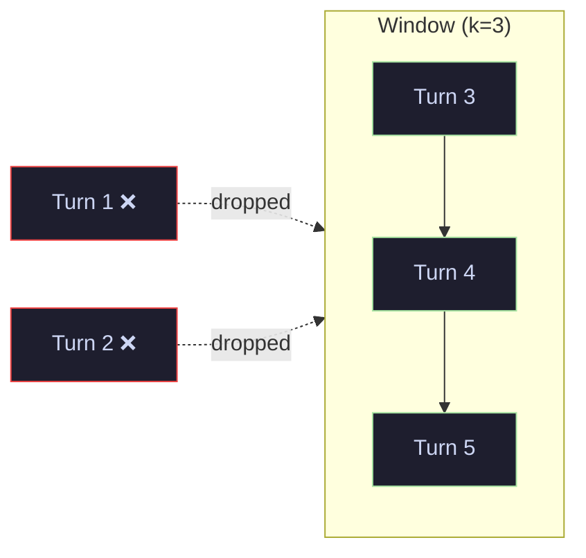
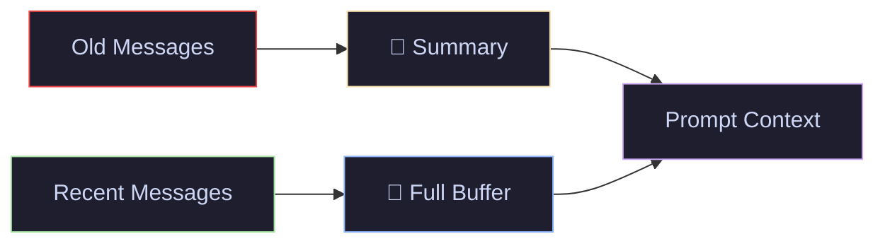

# 08 · Conversational Memory — Buffer, Window, Summary & Entity

> Give your LLM a memory — maintain context across conversation turns with different memory strategies.

---

## What You'll Learn

- Understand why LLMs need **external memory** (they're stateless by default)
- Use **ConversationBufferMemory** to store full conversation history
- Limit context with **ConversationBufferWindowMemory** (sliding window)
- Compress history with **ConversationSummaryMemory** (LLM-generated summaries)
- Track entities with **ConversationEntityMemory** (who, what, where)
- Combine strategies with **ConversationSummaryBufferMemory**
- Choose the right memory type for your use case

---

## Quick Start

```bash
pip install langchain langchain-openai
```

```python
from langchain.memory import ConversationBufferMemory
from langchain.chains import ConversationChain
from langchain_openai import ChatOpenAI

memory = ConversationBufferMemory()
chain = ConversationChain(llm=ChatOpenAI(), memory=memory)
chain.predict(input="Hi, I'm Hitesh!")
chain.predict(input="What's my name?")  # → "Your name is Hitesh!"
```

---

## Core Concepts

### 1 · Why Memory Matters

**The Problem** — LLMs are stateless. Every API call is independent. The model doesn't remember what you said 10 seconds ago.

**The Solution** — Memory modules store conversation history and inject it into the prompt on every turn, giving the illusion of continuity.

> **Analogy:** An LLM without memory is like a goldfish. Memory is the notebook you hand it before every conversation so it can read what happened before.


> **Key insight:** Memory is not magic. It just prepends conversation history to the prompt. Different memory types differ in **what** they store and **how much** context they inject.

---

### 2 · ConversationBufferMemory — Full History

**The Problem** — You need complete conversation fidelity. Every word matters.

**The Solution** — Stores the entire conversation verbatim. Simple and reliable for short conversations.

> **Analogy:** A court stenographer who transcribes every word. Complete record, but the transcript keeps growing.

```python
from langchain.memory import ConversationBufferMemory

memory = ConversationBufferMemory(return_messages=True)
```

**Tradeoff:** Linear token growth. A 50-turn conversation can easily exceed context limits. Best for short conversations (< 10-15 exchanges).

---

### 3 · ConversationBufferWindowMemory — Sliding Window

**The Problem** — Full history grows forever and wastes tokens on old, irrelevant exchanges.

**The Solution** — Keep only the last `k` exchanges. Older messages are dropped entirely.

> **Analogy:** A whiteboard that only fits 5 items. When you write a 6th, you erase the oldest one.

```python
from langchain.memory import ConversationBufferWindowMemory

memory = ConversationBufferWindowMemory(k=5, return_messages=True)
```



**Tradeoff:** Fixed token cost, but no memory of anything before the window. The model forgets your name if you said it 6 turns ago.

---

### 4 · ConversationSummaryMemory — Compressed History

**The Problem** — You need long-term context but can't afford unlimited tokens.

**The Solution** — Uses a secondary LLM call to progressively summarize the conversation. The summary replaces the full history.

> **Analogy:** Instead of keeping every page of meeting notes, you keep a one-paragraph executive summary that gets updated after each meeting.

```python
from langchain.memory import ConversationSummaryMemory
from langchain_openai import ChatOpenAI

memory = ConversationSummaryMemory(
    llm=ChatOpenAI(model="gpt-4o-mini"),
    return_messages=True
)
```

**Tradeoff:** Slower (requires extra LLM call per turn) and summaries can lose details. But token usage grows logarithmically instead of linearly.

---

### 5 · ConversationSummaryBufferMemory — Best of Both

**The Problem** — Summary memory loses recent details. Buffer memory grows too fast.

**The Solution** — Keep recent messages in a buffer and summarize everything older. You get full detail for the last few turns and compressed context for everything before.

```python
from langchain.memory import ConversationSummaryBufferMemory

memory = ConversationSummaryBufferMemory(
    llm=ChatOpenAI(model="gpt-4o-mini"),
    max_token_limit=300,       # buffer threshold — summarize beyond this
    return_messages=True
)
```



> **When to use:** The most practical choice for production chatbots. Recent messages have full fidelity while older context is compressed.

---

### 6 · ConversationEntityMemory — Tracking Facts

**The Problem** — In long conversations, the model forgets specific facts about people, places, and things mentioned earlier.

**The Solution** — Maintains a structured store of entities (people, organizations, concepts) mentioned in the conversation, updated after each turn.

> **Analogy:** A CRM that tracks every person and company mentioned in conversation, updating their profile as new facts emerge.

```python
from langchain.memory import ConversationEntityMemory

memory = ConversationEntityMemory(
    llm=ChatOpenAI(model="gpt-4o-mini"),
    return_messages=True
)
```

> **When to use:** Support bots that need to track customer details, personal assistants that remember user preferences, or any scenario where structured entity tracking matters more than full conversation recall.

---

## Cheat Sheet

<table>
<tr>
<th>Memory Type</th>
<th>Stores</th>
<th>Token Growth</th>
<th>Best For</th>
</tr>
<tr>
<td><b>Buffer</b></td>
<td>Full conversation</td>
<td>Linear (unbounded)</td>
<td>Short conversations (< 15 turns)</td>
</tr>
<tr>
<td><b>BufferWindow</b></td>
<td>Last K exchanges</td>
<td>Fixed</td>
<td>Recent context only</td>
</tr>
<tr>
<td><b>Summary</b></td>
<td>LLM-generated summary</td>
<td>Logarithmic</td>
<td>Long conversations, cost-sensitive</td>
</tr>
<tr>
<td><b>SummaryBuffer</b></td>
<td>Summary + recent buffer</td>
<td>Bounded</td>
<td>Production chatbots (best balance)</td>
</tr>
<tr>
<td><b>Entity</b></td>
<td>Entity profiles</td>
<td>Per-entity</td>
<td>Tracking facts about people/things</td>
</tr>
</table>

---

## File Structure

```
08-conversational-memory/
├── README.md                    ← you are here
└── conversational_memory.ipynb  ← runnable notebook with all memory types
```

## Navigation

⬅️ **[07 · RAG + Chroma](../07-rag-chroma/)** · ➡️ **[09 · Agents & Tools](../09-agents-tools/)**

---

<p align="center">
  Part of the <a href="https://github.com/hitpant/langchain-tutorials">LangChain Tutorials</a> series by <a href="https://github.com/hitpant">Hitesh Pant</a>
</p>
