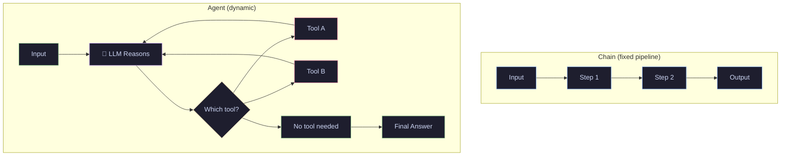
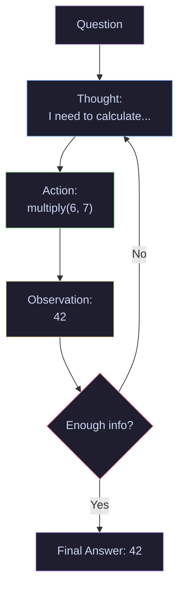

# 09 · Agents & Custom Tools — ReAct, Tool Routing & Custom Functions

> Give your LLM the ability to take actions — search the web, run calculations, call APIs, and decide which tool to use.

---

## What You'll Learn

- Understand **agents** vs chains (decision-making vs fixed pipelines)
- Build **custom tools** with the `@tool` decorator
- Create a **ReAct agent** that reasons and acts in a loop
- Use **AgentExecutor** to run agents with error handling
- Implement **multi-tool routing** (LLM picks the right tool)
- Add **structured tool inputs** with Pydantic schemas

---

## Quick Start

```bash
pip install langchain langchain-openai
```

```python
from langchain.agents import create_react_agent, AgentExecutor
from langchain_openai import ChatOpenAI
from langchain.tools import tool

@tool
def multiply(a: int, b: int) -> int:
    """Multiply two numbers together."""
    return a * b

# Agent decides when and how to use the tool
```

---

## Core Concepts

### 1 · Agents vs Chains

**The Problem** — Chains follow a fixed pipeline: prompt → LLM → output. But what if the task requires different tools depending on the question?

**The Solution** — Agents use an LLM as a reasoning engine to decide which tools to call, in what order, and with what inputs. The LLM doesn't just generate text — it makes decisions.

> **Analogy:** A chain is a recipe you follow step by step. An agent is a chef who reads the order, decides which tools and ingredients to use, and adapts if something goes wrong.



> **Key insight:** Chains are deterministic (same path every time). Agents are dynamic (the LLM chooses the path based on the input).

---

### 2 · The ReAct Pattern

**The Problem** — You need the agent to show its reasoning, not just call tools blindly.

**The Solution** — ReAct (Reasoning + Acting) alternates between thinking about what to do and taking action. The loop continues until the agent has enough information to give a final answer.

> **Analogy:** ReAct is the scientific method for LLMs: observe → hypothesize → experiment → observe → conclude.



---

### 3 · Custom Tools with @tool

**The Problem** — You need the agent to call your own functions — calculations, API lookups, database queries.

**The Solution** — The `@tool` decorator converts any Python function into a LangChain tool. The function name, docstring, and type hints are automatically used by the agent.

```python
from langchain.tools import tool

@tool
def word_count(text: str) -> int:
    """Count the number of words in a given text."""
    return len(text.split())

# The agent sees: name="word_count", description="Count the number of words..."
```

> **Key insight:** The docstring is critical. The agent uses it to decide when to call the tool. A vague docstring = the agent won't know when to use it.

---

### 4 · AgentExecutor

**The Problem** — Agents can loop forever, hit errors, or return malformed tool calls.

**The Solution** — `AgentExecutor` wraps the agent with error handling, iteration limits, and output parsing.

```python
from langchain.agents import AgentExecutor

executor = AgentExecutor(
    agent=agent,
    tools=tools,
    verbose=True,          # show reasoning steps
    max_iterations=5,      # prevent infinite loops
    handle_parsing_errors=True,  # graceful error recovery
)
```

---

### 5 · Structured Tool Inputs

**The Problem** — Complex tools need validated, multi-field inputs.

**The Solution** — Use Pydantic models to define tool input schemas. The agent generates structured inputs that are validated before the tool runs.

```python
from pydantic import BaseModel, Field
from langchain.tools import tool

class SearchInput(BaseModel):
    query: str = Field(description="The search query")
    max_results: int = Field(default=5, description="Max results to return")

@tool(args_schema=SearchInput)
def search_docs(query: str, max_results: int = 5) -> str:
    """Search the documentation for relevant articles."""
    return f"Found {max_results} results for: {query}"
```

---

## Cheat Sheet

<table>
<tr>
<th>Component</th>
<th>Code</th>
<th>What It Does</th>
</tr>
<tr>
<td><b>@tool decorator</b></td>
<td><code>@tool</code></td>
<td>Converts a function into an agent tool</td>
</tr>
<tr>
<td><b>ReAct Agent</b></td>
<td><code>create_react_agent(llm, tools, prompt)</code></td>
<td>Reason + Act loop</td>
</tr>
<tr>
<td><b>Tool Calling Agent</b></td>
<td><code>create_tool_calling_agent(llm, tools, prompt)</code></td>
<td>Native function calling</td>
</tr>
<tr>
<td><b>AgentExecutor</b></td>
<td><code>AgentExecutor(agent, tools)</code></td>
<td>Runs agent with error handling</td>
</tr>
<tr>
<td><b>Structured Input</b></td>
<td><code>@tool(args_schema=MyModel)</code></td>
<td>Pydantic-validated tool inputs</td>
</tr>
<tr>
<td><b>Max Iterations</b></td>
<td><code>max_iterations=5</code></td>
<td>Prevents infinite agent loops</td>
</tr>
</table>

---

## File Structure

```
09-agents-tools/
├── README.md              ← you are here
└── agents_tools.ipynb     ← runnable notebook with all sections
```
---

<p align="center">
  Part of the <a href="https://github.com/hitpant/langchain-tutorials">LangChain Tutorials</a> series by <a href="https://github.com/hitpant">Hitesh Pant</a>
</p>
