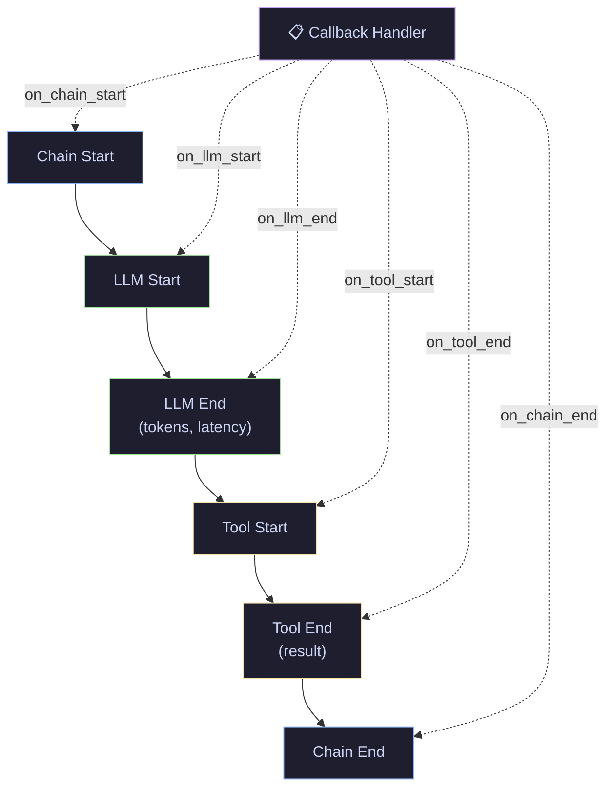
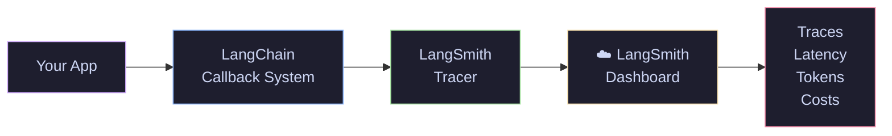

# 10 · Callbacks & Tracing — Custom Handlers, LangSmith & Cost Tracking

> Monitor every step of your LangChain pipeline — track tokens, measure latency, log events, and debug with LangSmith.

---

## What You'll Learn

- Understand LangChain's **callback system** and event lifecycle
- Build a **custom callback handler** for logging and metrics
- Track **token usage and costs** with `get_openai_callback`
- Set up **LangSmith tracing** for production observability
- Measure **latency** across chains, LLMs, and tools
- Combine callbacks for **full-stack monitoring**

---

## Quick Start

```bash
pip install langchain langchain-openai langsmith
```

```python
from langchain_community.callbacks import get_openai_callback
from langchain_openai import ChatOpenAI

llm = ChatOpenAI(model="gpt-4o-mini")

with get_openai_callback() as cb:
    llm.invoke("What is RAG?")
    print(f"Tokens: {cb.total_tokens} | Cost: ${cb.total_cost:.6f}")
```

---

## Core Concepts

### 1 · The Callback System

**The Problem** — LangChain chains, agents, and tools run as black boxes. You can't see what's happening inside.

**The Solution** — Callbacks are hooks that fire at key lifecycle events: when an LLM starts/ends, when a chain runs, when a tool is called, when an error occurs. You attach handlers that react to these events.

> **Analogy:** Callbacks are event listeners for your AI pipeline. Like `onClick` in a web app, but for LLM calls, tool executions, and chain runs.



**Key callback events:**
- `on_llm_start` / `on_llm_end` : LLM call begins/completes
- `on_chain_start` / `on_chain_end` : Chain execution begins/completes
- `on_tool_start` / `on_tool_end` : Tool call begins/completes
- `on_llm_error` / `on_chain_error` : Error handling

---

### 2 · Custom Callback Handler

**The Problem** — You need custom logging, metrics, or alerting that built-in handlers don't provide.

**The Solution** — Subclass `BaseCallbackHandler` and override the events you care about.

```python
from langchain_core.callbacks import BaseCallbackHandler
import time

class LatencyHandler(BaseCallbackHandler):
    def on_llm_start(self, serialized, prompts, **kwargs):
        self.start_time = time.time()
        print(f"[LLM] Starting call...")

    def on_llm_end(self, response, **kwargs):
        elapsed = time.time() - self.start_time
        print(f"[LLM] Completed in {elapsed:.2f}s")
```

> **When to use:** Custom dashboards, alerting systems, audit logging, or any monitoring that goes beyond what LangSmith provides.

---

### 3 · Token Usage & Cost Tracking

**The Problem** — LLM API calls cost money. Without tracking, you get surprise bills.

**The Solution** — `get_openai_callback` is a context manager that tracks tokens and costs for all OpenAI calls within its scope.

```python
from langchain_community.callbacks import get_openai_callback

with get_openai_callback() as cb:
    chain.invoke({"input": "Explain RAG"})
    print(f"Prompt tokens: {cb.prompt_tokens}")
    print(f"Completion tokens: {cb.completion_tokens}")
    print(f"Total cost: ${cb.total_cost:.6f}")
```

> **Key insight:** Wrap your entire pipeline (including agents with multiple tool calls) in a single callback to get the total cost of the full interaction.

---

### 4 · LangSmith Tracing

**The Problem** — In production, you need to trace every request across chains, tools, and LLM calls. Custom handlers don't scale.

**The Solution** — LangSmith provides hosted tracing with a dashboard. Enable it with two environment variables.

```python
import os

os.environ["LANGSMITH_TRACING"] = "true"
os.environ["LANGSMITH_API_KEY"] = "your-api-key"
os.environ["LANGSMITH_PROJECT"] = "langchain-tutorials"

# No code changes needed — all LangChain calls are automatically traced
```



> **When to use:** Any production LangChain application. LangSmith's free tier is sufficient for development and small-scale production.

---

## Cheat Sheet

<table>
<tr>
<th>Tool</th>
<th>Code</th>
<th>What It Tracks</th>
</tr>
<tr>
<td><b>get_openai_callback</b></td>
<td><code>with get_openai_callback() as cb:</code></td>
<td>Tokens, cost per call</td>
</tr>
<tr>
<td><b>Custom Handler</b></td>
<td><code>class MyHandler(BaseCallbackHandler):</code></td>
<td>Anything you want</td>
</tr>
<tr>
<td><b>LangSmith</b></td>
<td><code>LANGSMITH_TRACING=true</code></td>
<td>Full traces, latency, tokens, costs</td>
</tr>
<tr>
<td><b>Verbose Mode</b></td>
<td><code>verbose=True</code></td>
<td>Stdout logging (dev only)</td>
</tr>
</table>

---

## File Structure

```
10-callbacks-tracing/
├── README.md                 ← you are here
└── callbacks_tracing.ipynb   ← runnable notebook with all sections
```

## Navigation

⬅️ **[09 · Agents & Tools](../09-agents-tools/)** · **Series Complete!** 🎉

---

<p align="center">
  Part of the <a href="https://github.com/hitpant/langchain-tutorials">LangChain Tutorials</a> series by <a href="https://github.com/hitpant">Hitesh Pant</a>
</p>
