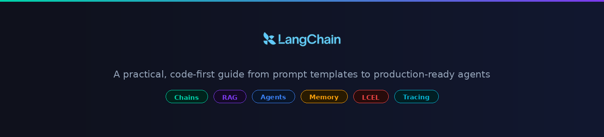
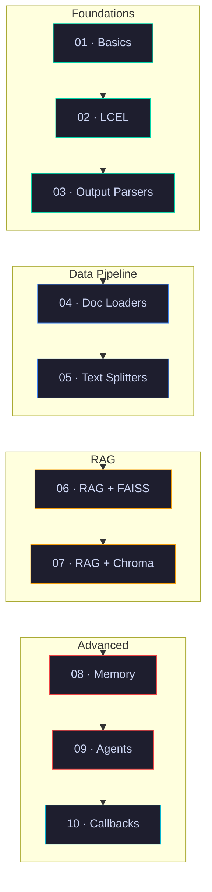

<p align="center">
  
</p>

<p align="center">
  
  
  
  
  
</p>

---

## Scope & Coverage

A collection of self-contained, code-first tutorials that cover LangChain from foundational concepts to production patterns. Each tutorial is a standalone module with a runnable notebook and a README documenting the core logic.

Built for engineers who want working references — not theory dumps.

---

## Tutorials

| # | Tutorial | What You'll Build | Status |
|:-:|----------|-------------------|:------:|
| 01 | [**LangChain Basics**](./01-langchain-basics/) | Prompts, LLM wrappers, chains, batch & streaming | ✅ |
| 02 | [**LCEL Deep Dive**](./02-lcel-deep-dive/) | RunnableParallel, Lambda, Branch, Fallbacks | ✅ |
| 03 | **Output Parsers** | JSON, Pydantic, Enum, auto-fixing parsers | 🔜 |
| 04 | **Document Loaders** | PDF, CSV, Web, YouTube, GitHub loaders | 🔜 |
| 05 | **Text Splitters** | Recursive, Token, Semantic chunking | 🔜 |
| 06 | **RAG with FAISS** | Embeddings, vector store, retrieval chain | 🔜 |
| 07 | **RAG with ChromaDB** | Persistent store, metadata filtering, MMR | 🔜 |
| 08 | **Conversational Memory** | Buffer, Summary, Window, Entity memory | 🔜 |
| 09 | **Agents & Custom Tools** | ReAct agent, custom tools, tool routing | 🔜 |
| 10 | **Callbacks & Tracing** | Custom handlers, LangSmith, cost tracking | 🔜 |

---

## Learning Path



Tutorials are grouped by theme but self-contained — jump to any topic that's relevant to you.

---

## Quick Start

```bash
git clone https://github.com/HitPant/langchain-tutorials.git
cd langchain-tutorials
pip install langchain langchain-openai langchain-anthropic langchain-community \
            faiss-cpu chromadb tiktoken
```

```bash
export OPENAI_API_KEY="sk-..."
export ANTHROPIC_API_KEY="sk-ant-..."
```

Pick a tutorial folder and open the notebook.

---

## Who This Is For

- **Software Engineers** building LLM-powered products
- **ML/AI Engineers** evaluating LangChain for production
- **Solutions Engineers** needing quick reference implementations

---

<p align="center">
  Built by <a href="https://github.com/HitPant">Hitesh Pant</a>
</p>

<p align="center">
  <a href="https://www.linkedin.com/in/hitesh-pant/"></a>
  <a href="https://github.com/HitPant"></a>
  <a href="https://medium.com/@hitpant"></a>
  <a href="https://x.com/hitpant21"></a>
  <a href="https://hitpant.github.io/"></a>
</p>
