<p align="center">
  
</p>

<p align="center">
  
  
  
  
  
</p>

---

## Scope & Coverage

A collection of self-contained, code-first tutorials that cover LangChain from foundational concepts to production patterns. Each tutorial is a standalone module with a runnable notebook and a README documenting the core logic.

Built for engineers who want working references — not theory dumps.

---

## Tutorials

| # | Tutorial | What You'll Build | Notebook |
|:-:|----------|-------------------|:--------:|
| 01 | [**LangChain Basics**](./01-langchain-basics/) | Prompts, LLM wrappers, chains, batch & streaming | [→](./01-langchain-basics/langchain_basics.ipynb) |
| 02 | [**LCEL Deep Dive**](./02-lcel-deep-dive/) | RunnableParallel, Lambda, Branch, Fallbacks | [→](./02-lcel-deep-dive/lcel_deep_dive.ipynb) |
| 03 | [**Output Parsers**](./03-output-parsers/) | JSON, Pydantic, Enum, auto-fixing parsers | [→](./03-output-parsers/output_parsers.ipynb) |
| 04 | [**Document Loaders**](./04-document-loaders/) | PDF, CSV, Web, YouTube, GitHub loaders | [→](./04-document-loaders/document_loaders.ipynb) |
| 05 | [**Text Splitters**](./05-text-splitters/) | Recursive, Token, Semantic chunking | [→](./05-text-splitters/text_splitters.ipynb) |
| 06 | [**RAG with FAISS**](./06-rag-faiss/) | Embeddings, vector store, retrieval chain | [→](./06-rag-faiss/rag_faiss.ipynb) |
| 07 | [**RAG with ChromaDB**](./07-rag-chroma/) | Persistent store, metadata filtering, MMR | [→](./07-rag-chroma/rag_chroma.ipynb) |
| 08 | [**Conversational Memory**](./08-conversational-memory/) | Buffer, Summary, Window, Entity memory | [→](./08-conversational-memory/conversational_memory.ipynb) |
| 09 | [**Agents & Custom Tools**](./09-agents-tools/) | ReAct agent, custom tools, tool routing | [→](./09-agents-tools/agents_tools.ipynb) |
| 10 | [**Callbacks & Tracing**](./10-callbacks-tracing/) | Custom handlers, LangSmith, cost tracking | [→](./10-callbacks-tracing/callbacks_tracing.ipynb) |

---

## Learning Path

```mermaid
flowchart LR
    A["01\nBasics"] --> B["02\nLCEL"]
    B --> C["03\nOutput\nParsers"]
    C --> D["04\nDoc\nLoaders"]
    D --> E["05\nText\nSplitters"]
    E --> F["06\nRAG\nFAISS"]
    F --> G["07\nRAG\nChroma"]
    G --> H["08\nMemory"]
    H --> I["09\nAgents"]
    I --> J["10\nCallbacks"]

    style A fill:#1e1e2e,stroke:#00d4aa,color:#cdd6f4
    style B fill:#1e1e2e,stroke:#00d4aa,color:#cdd6f4
    style C fill:#1e1e2e,stroke:#7c3aed,color:#cdd6f4
    style D fill:#1e1e2e,stroke:#3b82f6,color:#cdd6f4
    style E fill:#1e1e2e,stroke:#3b82f6,color:#cdd6f4
    style F fill:#1e1e2e,stroke:#f59e0b,color:#cdd6f4
    style G fill:#1e1e2e,stroke:#f59e0b,color:#cdd6f4
    style H fill:#1e1e2e,stroke:#ef4444,color:#cdd6f4
    style I fill:#1e1e2e,stroke:#ef4444,color:#cdd6f4
    style J fill:#1e1e2e,stroke:#06b6d4,color:#cdd6f4
```



Tutorials are sequential but self-contained — jump to any topic that's relevant to you.

---

## Quick Start

```bash
git clone https://github.com/hitpant/langchain-tutorials.git
cd langchain-tutorials
pip install langchain langchain-openai langchain-anthropic langchain-community \
            faiss-cpu chromadb tiktoken
```

```bash
export OPENAI_API_KEY="sk-..."
export ANTHROPIC_API_KEY="sk-ant-..."
```

Pick a tutorial folder and open the notebook.

---

## Who This Is For

- **Software Engineers** building LLM-powered products
- **ML/AI Engineers** evaluating LangChain for production
- **Solutions Engineers** needing quick reference implementations

---

<p align="center">
  Built by <a href="https://github.com/hitpant">Hitesh Pant</a> · <a href="https://www.linkedin.com/in/hiteshpant/">LinkedIn</a>
</p>
